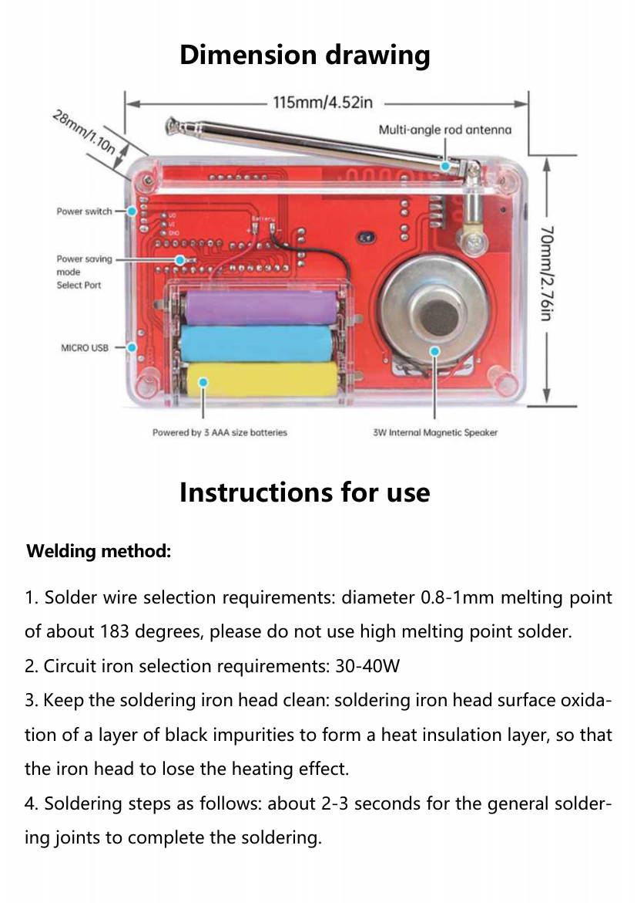
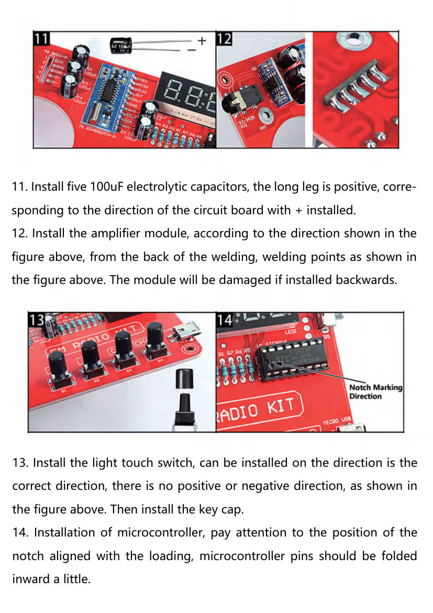
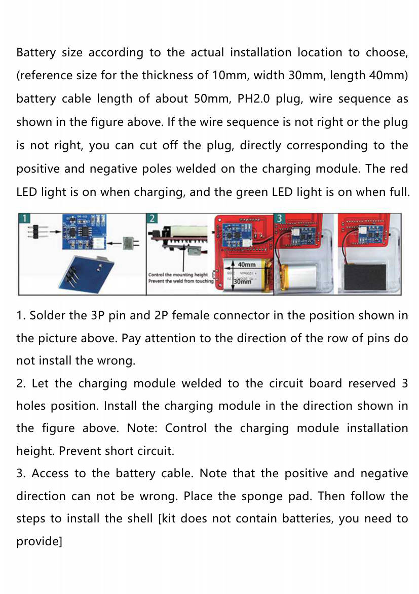

# FM radio kit: instruction manual

**This file is the seller's instruction manual of the FM radio kit, in
Markdown.** It covers the parts, the tools, the 28 assembly steps, and the
use of the radio. The steps that hold an orientation risk carry a page
image, so the Engineer can compare a photo of the board with the manual.

- **Source:** the manual PDF of the kit, file `A1KLFMlAjbL.pdf` (15
  pages, file date 2025-05-13). The file does not name the seller.
- **Converted:** 2026-09-29, by hand, from the text and pages of the PDF.
  The wording is shorter. Page numbers match the PDF.
- **Product data:** see `fm-radio-kit-product.md`. The circuit is in
  `fm-radio-kit-schematic.md`.

## The kit

**The kit is a digital FM receiver in a clear case.** A tuner module
(RDA5807FP-M) does the radio. A 16-pin microcontroller (STC8G1K17) reads
four buttons and drives a 4-digit display. An 8002 module amplifies the
audio for a 4 Ω, 3 W speaker (40 mm).

| Item               | Value from the manual                                                |
| ------------------ | -------------------------------------------------------------------- |
| Power              | 3 AAA batteries, or a 3.7 V lithium battery. The kit has no battery  |
| Charging           | The rechargeable version has a charging module and a micro-USB port  |
| Search range       | 50 to 108 MHz                                                        |
| Signal-to-noise    | More than 60 dB                                                      |
| Sensitivity        | Less than 10 µV                                                      |
| Frequency response | 150 Hz to 20 kHz                                                     |
| Size               | 115 × 70 × 28 mm                                                     |
| Control chip       | The manual writes "RDA5807 8002D (STC81K17 digital display version)" |

**The chip name has a typo in the manual.** The photo of the board shows
`STC8G1K17` on the microcontroller (page 9, step 14). The tuner datasheet
covers the RDA5807FP, and the amplifier text names the 8002D.

## Tools and solder (pages 4 to 6)

- **Solder wire:** 0.8 to 1 mm, melting point about 183 °C. Do not use
  solder with a high melting point.
- **Iron:** 30 to 40 W. Keep the tip clean.
- **A joint takes 2 to 3 seconds.**
- **Order of work:** check the parts first, and measure them with a
  multimeter when possible. Solder the short parts first, then the tall
  ones. Cut the pins after each part.
- **Heat:** a hot iron or a long contact damages the board or a part.
- **After soldering:** check each joint, and check that no part sits wrong.
- **First power:** never reverse the supply. The manual says the voltage
  cannot exceed 3 V. The kit runs on 3 AAA cells (4.5 V) or on a 3.7 V
  cell, so this line conflicts with the rest of the manual. See the
  conflicts below.
- **Batteries:** match the battery to the circuit. A wrong battery burns
  the circuit or damages the battery.
- **Fault finding:** check the supply first, then the parts and the joints.

Figure file: `/datasheets/images/manual-p04.jpg`. It shows the power switch,
the power saving mode select port, the micro-USB port, the battery holder
for 3 AAA cells, the 3 W speaker, and the antenna.

## Assembly steps (pages 6 to 14)

| Step | Action                                                     | Orientation or risk                                                   |
| ---- | ---------------------------------------------------------- | --------------------------------------------------------------------- |
| 1    | Install seven 47 Ω resistors                               | No polarity                                                           |
| 2    | Install the micro-USB female socket                        | Follow the footprint on the board                                     |
| 3    | Install the 16-pin IC socket                               | **The notch matches the notch on the silkscreen**                     |
| 4    | Install the toggle switch                                  | Keep heat low on the middle 3 pins. Heat melts the handle             |
| 5    | Install the audio jack                                     | Do not melt the plastic. Too much solder at the arrow shorts pins     |
| 6    | Install the crystal of the radio module                    | No polarity. Keep the pins long and the heat low                      |
| 7    | Tin one pad of the radio module board                      | Tin first, so the module can be held                                  |
| 8    | Align the module pads, and fix one point first             | The module must not move                                              |
| 9    | Solder the other pads of the module                        | No bridges, no cold joints, no missed pads                            |
| 10   | Install the digital tube (display)                         | **Follow the direction in the picture on page 8**                     |
| 11   | Install five 100 µF electrolytic capacitors                | **The long leg is +. Match the + mark on the board**                  |
| 12   | Install the amplifier module, soldered from the back       | **Follow the picture on page 9. A reversed module is damaged**        |
| 13   | Install the four tactile switches, then the key caps       | No polarity                                                           |
| 14   | Install the microcontroller in its socket                  | **The notch matches the socket notch. Bend the pins inward a little** |
| 15   | Install the antenna                                        |                                                                       |
| 16   | Install the battery springs, cut off the wire terminals    | See the pictures on page 10                                           |
| 17   | Bend the wire terminals outward, tin the + and − terminals |                                                                       |
| 18   | Solder the battery wires                                   | **Red is +, black is −**                                              |
| 19   | Put in the batteries                                       | The kit has none                                                      |
| 20   | Put foam on the batteries, route the wires, fix the board  |                                                                       |
| 21   | Fix the antenna with the 3 mm nut                          |                                                                       |
| 22   | Tin the speaker terminals and solder the wires             | Red is +, black is −                                                  |
| 23   | Tin the speaker pads VO+ and VO− on the board              |                                                                       |
| 24   | Connect the speaker wires                                  | **VO+ to the red wire, VO− to the black wire**                        |
| 25   | Put the speaker in its holes                               |                                                                       |
| 26   | Snap on the case                                           |                                                                       |
| 27   | Fix the case with the screws                               | Do not over-tighten                                                   |
| 28   | Optional: bridge the two solder points on the back         | The display then stays on all the time                                |

**The pages below show the risky steps.** Use them to compare a photo of the
board with the manual before the person solders.

| Steps           | Page image                                       | File                                |
| --------------- | ------------------------------------------------ | ----------------------------------- |
| 1 and 2         | Resistors and micro-USB socket                   | `/datasheets/images/manual-p06.jpg` |
| 3 to 6          | IC socket, switch, audio jack, crystal           | `/datasheets/images/manual-p07.jpg` |
| 7 to 10         | Module soldering, display direction              | `/datasheets/images/manual-p08.jpg` |
| 11 to 14        | Capacitors, amplifier, buttons, microcontroller  | `/datasheets/images/manual-p09.jpg` |
| 15 to 18        | Antenna, battery springs, wires                  | `/datasheets/images/manual-p10.jpg` |
| 19 to 22        | Battery, foam, antenna nut, speaker terminals    | `/datasheets/images/manual-p11.jpg` |
| 23 to 26        | Speaker wires and case                           | `/datasheets/images/manual-p12.jpg` |
| 27, 28, charger | Case screws, back solder points, charging module | `/datasheets/images/manual-p13.jpg` |
| Charger         | Charging module install                          | `/datasheets/images/manual-p14.jpg` |

## Rechargeable version (pages 13 and 14)

- **The kit adds a charging module,** a 3P pin header, a 2P female
  connector, and a lanyard. It does not add a battery.
- **The battery:** a 3.7 V lithium cell with a protection board. The
  reference size is 10 mm thick, 30 mm wide, and 40 mm long. The cable is
  about 50 mm with a PH2.0 plug. Cut off the plug when the wire order
  does not match, and solder to the + and − pads of the module.
- **Installation:** solder the 3P pin and the 2P female connector in the
  place that the picture shows. Watch the direction of the pin row. Solder
  the module to the three holes of the board. Control its height, so it
  does not short. Connect the battery with the right polarity.
- **Indicators:** the red LED is on while charging. The green LED is on
  when the battery is full.

## Use (page 15)

1. **Power:** the switch up connects the battery. The switch down
   connects the micro-USB supply.
2. **Start:** after power-on the indicator lights and the radio makes a
   rustling sound. Pull the antenna and tune. When the indicator is on and
   there is no sound, disconnect the power, wait about half a minute, and
   power on again.
3. **Station:** CH+ selects the next station, and CH− selects the previous
   one. Selecting a station searches at the same time, so wait.
4. **Volume:** V− lowers the volume, and V+ raises it.
5. **Headphones:** a headphone plug in the jack moves the sound to the
   headphones. The kit has no headphones.
6. **Reception:** turn and extend the antenna. Places with many buildings
   or remote mountain areas have fewer stations.

## Conflicts and open points

The schematic (`fm-radio-kit-schematic.md`) settles the first two points.

- **Supply voltage: the 3 V line is not a limit of VDD.** The manual says
  the voltage cannot exceed 3 V (page 6, item 7). The tuner chip and the
  microcontroller run from the regulated net 3V3 (3.3 V). The regulator
  input VDD (3.7 to 4.8 V) also feeds the 8002, which allows 6.0 V. The
  circuit has no reverse-polarity protection. Read VDD and 3V3 at the
  first power-on.
- **Micro-USB power: the product page is right.** The picture connects
  USB only to the charging module socket. The switch down selects the
  charging-module output. Without a charging module, USB powers nothing.
- **Search range.** The manual gives 50 to 108 MHz. The tuner datasheet
  gives 50 to 115 MHz, and its default band is 87 to 108 MHz. The band
  bits that the firmware sets decide the range (`rda5807fp.md`).
- **Controller name.** The manual writes STC81K17. The board photo shows
  STC8G1K17.
- **Which battery.** The parameter table says "3 No. 7 batteries", which
  means AAA cells.
