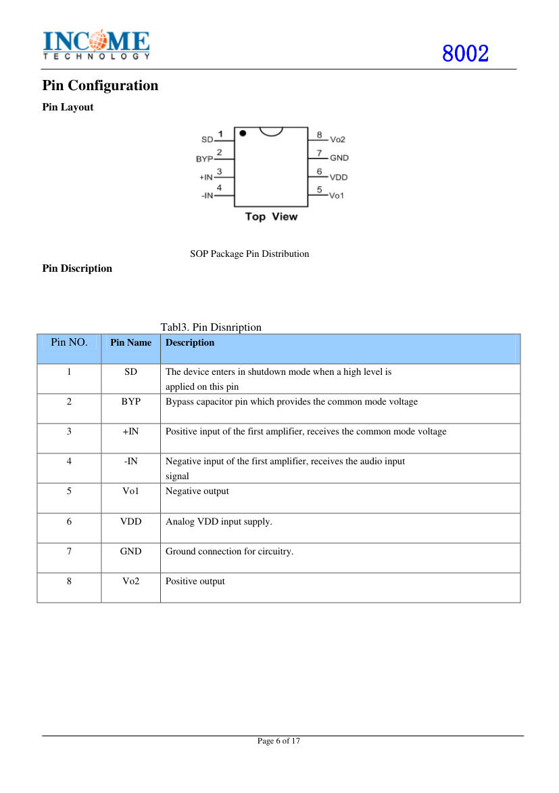
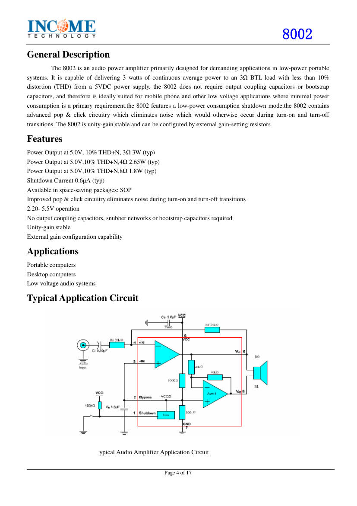
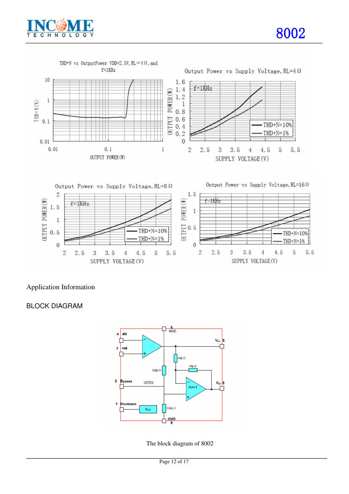

# 8002 (HXJ8002 / 8002D): 3 W audio power amplifier

**The 8002 is the audio amplifier of the kit.** It drives the 4 Ω, 3 W
speaker in a bridge configuration. The kit uses it on a small module named
8002-M. The product text calls the chip "8002D".

- **Source:** "8002 DataSheet V1.0", 17 pages, HXJ8002 miniature audio
  amplifier: <https://jarl-mie.com/01/image/tec2020/HXJ8002_Miniature_Audio_Amplifier_Datasheet.pdf>.
  The datasheet does not name a manufacturer.
- **Converted:** 2026-09-29, by hand, from the text and figures of the PDF.
- **Not covered:** the datasheet describes the SOP-8 chip. It does not
  describe the module board of the kit.

## Key facts

| Item                          | Value                                                    |
| ----------------------------- | -------------------------------------------------------- |
| Type                          | Mono, bridge-tied load (BTL). The kit text says class AB |
| Supply                        | 2.2 to 5.5 V. Absolute maximum 6.0 V                     |
| Output power, 5 V, 10 % THD+N | 3 W at 3 Ω, 2.56 to 2.65 W at 4 Ω, 1.8 W at 8 Ω          |
| Output power, 5 V, 1 % THD    | 2.3 W at 3 Ω, 2 W at 4 Ω, 1.3 W at 8 Ω                   |
| Quiescent current, 5 V        | 6.5 mA typical (no load), 10 mA maximum                  |
| Shutdown current              | 0.8 µA typical, 2 µA maximum (features list says 0.6 µA) |
| Wake-up time                  | 100 ms typical                                           |
| Gain                          | Set by outside resistors. Unity-gain stable              |
| Junction limit                | 150 °C                                                   |
| Package                       | SOP-8                                                    |

**The speaker of the kit is 4 Ω.** The output figures apply at 5 V. The kit
supplies the amplifier with 3.7 to 4.8 V, so the power is lower.

## Pins (SOP-8)

Figure file: `/datasheets/images/hxj8002-p06.jpg`.

| Pin | Name | Function                                             |
| --- | ---- | ---------------------------------------------------- |
| 1   | SD   | **Shutdown.** A high level puts the chip in shutdown |
| 2   | BYP  | Bypass capacitor pin, sets the common-mode voltage   |
| 3   | +IN  | Positive input of the first amplifier                |
| 4   | −IN  | Negative input. The audio signal enters here         |
| 5   | Vo1  | Negative output                                      |
| 6   | VDD  | Supply                                               |
| 7   | GND  | Ground                                               |
| 8   | Vo2  | Positive output                                      |

## Absolute maximum ratings (page 5)

| Parameter            | Value                     |
| -------------------- | ------------------------- |
| Supply voltage       | 6.0 V                     |
| Storage temperature  | −65 to +150 °C            |
| Input voltage        | −0.3 V to VDD + 0.3 V     |
| ESD                  | 2000 V                    |
| Junction temperature | 150 °C                    |
| Thermal resistance   | θJA 210 °C/W, θJC 56 °C/W |

## How the bridge works (page 13)

The first amplifier has an outside gain of Rf/Ri. The second amplifier
is fixed at −1 with two internal 20 kΩ resistors. The two outputs swing in
opposite directions, so the bridge gain is twice the gain of the first
amplifier: 2 × Rf/Ri. The output sits at half the supply, so the speaker
sees no DC and needs no coupling capacitor.

**General practice, not in the datasheet:** never connect a bridge output to
ground. Neither output is a ground reference, so a scope ground clip on an
output shorts the amplifier.

Figure file: `/datasheets/images/hxj8002-p04.jpg`.

## Shutdown and bypassing (page 14)

- **Shutdown:** tie the SD pin to a definite level. The chip does not like
  a floating pin. The kit ties it to GND, so the amplifier is always on.
- **Bypass:** place the supply and bypass capacitors close to the chip.
  The datasheet suggests 10 µF plus a ceramic capacitor on the supply.

Figure file: `/datasheets/images/hxj8002-p12.jpg`.

## Notes for the kit

- **Output names are a naming difference.** The kit schematic labels pin 5
  VO+ and pin 8 VO−. The datasheet calls pin 5 the negative output and pin 8
  the positive output. The first stage inverts, so pin 5 is in antiphase with
  the input and pin 8 is in phase. One speaker plays with either sign.
- **Module pinout.** The kit module 8002-M has 5 pins (IN, GND, VDD, VO+,
  VO−). The manual says the module is damaged if installed backwards
  (`fm-radio-kit-manual.md`, step 12).
- **Shutdown.** The kit ties SD to GND, so the amplifier is always on.
- **Bias.** The kit ties +IN (pin 3) to BYPASS (pin 2), and puts a capacitor
  from BYPASS to GND.
