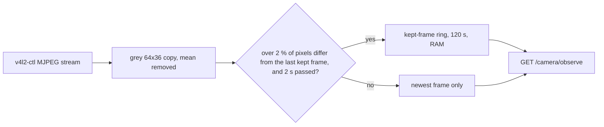

# Situation awareness

**This page is the source of truth for how Workbench knows what goes on at
the bench.** It names the sources of each fact, how long each source keeps
its data, and how a seat gets up to speed when a prompt wakes it. Update
this page with each change to a sensor, a digest, or the way a seat reads
them.

**The goal: a seat that receives a prompt knows the state of the bench
before it answers.** It knows what the notes say, what the room said, and
what the cameras, the microphone, and the instruments saw in the last
minutes. It backs each claim with a ref. `planning/next.md` holds the
milestone that this serves: objectives 1 to 4, and activities 6 and 9.

**Status: partly implemented.** The notes, the room record, and the supply
sensor work today. The frame ring of the cameras is the next change. The
sections below mark each part as implemented or planned.

## Three layers

**The facts of the bench live in three layers, by how fast they change.**

| Layer   | Holds                                                        | Lives in                                    | Kept for                   |
| ------- | ------------------------------------------------------------ | ------------------------------------------- | -------------------------- |
| Durable | Facts, decisions, open questions, the parts, the build step  | The notes, `shared/notes` (`docs/notes.md`) | Always, in git             |
| Session | What people and seats said, the shown widgets, the processes | The room record, the canvas, the workspace  | The life of the room       |
| Live    | What the sensors saw and measured in the last minutes        | A ring in each sensor server, in RAM        | 60 to 120 s, by the sensor |

**A fact moves up a layer when a seat concludes it.** A seat reads a live
observation, cites its snapshot ref in the room, and commits a claim to the
notes when the claim will stay true. The snapshot store keeps the evidence
of each cited ref.

## The live layer: one ring and one digest for each sensor

**Each sensor server captures all the time, and keeps its recent data in a
ring in RAM.** A read of the sensor returns its digest: a small selection
that a seat can read at once. The server computes the digest on the
workstation, so raw frames and sound stay there.

**Media goes to disk only as evidence.** A sensor server writes no frame
and no clip to disk by itself. When a seat fetches one, the workspace
snapshot store keeps it, and the ref stays valid after the ring drops it.

| Sensor                      | Ring                                          | Digest                                                                            | Status                               |
| --------------------------- | --------------------------------------------- | --------------------------------------------------------------------------------- | ------------------------------------ |
| `psu` `output`              | 60 s, 4 samples each second                   | `recent`: statistics over 3, 5, 15, 30, and 60 s, and the changes of the settings | Implemented                          |
| `camera` (BRIO, microscope) | 120 s of the frames that the change rule kept | The kept frames and the newest frame, oldest first                                | Planned, the next change             |
| `microphone` (BRIO)         | None                                          | One clip on request, with a level series                                          | Implemented on request; ring planned |
| USB devices                 | None                                          | None. `device-scan` runs once                                                     | Planned                              |

### The supply

**The `psu` sensor samples each channel 4 times each second.** It keeps 60 s
in memory and refills them from `samples.jsonl` after a restart. `recent`
gives the statistics of each window and the changes of the settings, with
the owner of each change. A span read of `output` gives the samples.
`templates/psu/README.md` holds the details.

### The cameras (planned)

**The camera server streams, and keeps a frame only when the scene
changed.** The ring is the digest. A read of `/camera/observe` returns the
kept frames of the last 120 s and the newest frame, oldest first.

- **Capture.** A reader thread runs `v4l2-ctl --stream-mmap --stream-to=-`
  with the MJPEG format, and splits the stream into JPEG frames. After an
  unplug, it finds the node by `--usb-id` again and restarts the stream.
  `fswebcam` goes away.
- **The change rule.** The thread makes a grey 64x36 copy of each frame
  with Pillow, and subtracts its mean grey, so a change of exposure does
  not count. A pixel differs when its grey value moves by more than 20. The
  thread keeps the frame when more than 2 % of the pixels differ from the
  last kept frame, and 2 s passed since that frame. The scene after a
  movement differs from the last kept frame, so the rule keeps it too.
- **Memory.** The ring holds the JPEG bytes of the stream, with no new
  encode. At 1280x720 a frame is about 100 to 200 KB, so the ring stays
  under 10 MB for each camera.
- **The answer.** Each observation has a text part and a `frame` part with
  `mediaType: image/jpeg`. The text gives the receipt time, the age, and
  the share of changed pixels. On the newest frame it says "no change
  since" the time of the last kept frame when nothing changed.
- **Files.** `/files/<digest>` reads the ring, then the disk. A frame that
  left the ring and that no seat fetched gives 404.
- **The viewfinder needs no change.** It takes the last observation as the
  newest frame (`src/host/viewfinder.ts`). Its poll every 3 s then costs
  no capture and writes nothing to disk.

**Known risks.** A stream reserves USB bandwidth all the time, so two
cameras need separate USB controllers. A UVC camera can send MJPEG frames
with no Huffman tables, so check that a frame decodes in Pillow and in the
terminal. The autofocus of the microscope can count as a change. The first
bench session checks these, and tunes the 2 % and the 20.

### The microphone (planned)

**The microphone gets a ring on the same pattern.** One `arecord` runs all
the time, and the server keeps 120 s of samples in RAM: 11.5 MB at 48 kHz,
mono, 16-bit. The digest is the level of each second and the times at
which a sound starts or stops. A clip of the last seconds returns at once.
A transcript of speech records what people say, so it waits for a decision
of the person.

### Time

**Every sensor stamps UTC with milliseconds, from the clock of the
workstation.** All sensor servers run on one machine, so their times agree.
A camera frame carries its receipt time. A supply sample carries its slot.
The room record stamps messages with the clock of the host, which can be
another machine. Run NTP on both.

## How a seat gets up to speed

**A seat reads the layers in order: the record, the notes, then the live
sensors.** The record and the reminders arrive with the activation. The
seat reads the rest with tools.

| Step | What the seat reads                                             | How                                                          | Status                      |
| ---- | --------------------------------------------------------------- | ------------------------------------------------------------ | --------------------------- |
| 1    | The prompt, the recent messages, and their refs                 | The room record, in the activation                           | Implemented                 |
| 2    | The shown cameras and their process handles                     | The widget reminder, in the activation                       | Implemented                 |
| 3    | The facts, the decisions, and the open questions of the subject | `git` and `read` in the clone of the notes                   | Implemented                 |
| 4    | The running sensor servers                                      | `ps`                                                         | Implemented                 |
| 5    | The last minutes of each sensor                                 | `fetch` of `/camera/observe` and `/recent/observe` by handle | Supply now; cameras planned |

**A seat cites what it read.** Each `fetch` returns a snapshot ref. A claim
about the bench in a message cites the ref of its frame, clip, or reading.

**Steps 4 and 5 cost several tool calls today.** The planned consolidation
reduces them:

1. **One call for the live layer** (planned). A skill step tells the seat
   to fetch the digest of every running sensor at the start of a question
   about the bench.
2. **A bench brief in the activation** (planned, needs Ambion). The host
   reads each digest and gives the seat what changed since it last looked.
   `planning/next.md` names this Ambion need: reminders that give each seat
   what changed. It goes into a brief in the project files, for the person
   to take to Ambion.
3. **A wake on a change** (planned). The host reads each digest, and posts
   to the seat that a significant change concerns, with `room.post` and a
   `key`. Ambion 0.8.0 supports this.

## Privacy

**Frames and sound stay on the workstation.** No sensor sends a frame or a
clip to a remote model unless the person asks. The rings live in RAM, and
a frame or a clip reaches disk only when a seat fetches it as evidence.
Face blur and a crop to the bench are planned (`planning/next.md`).

## How it is evaluated

- **Scripted tier.** Each sensor tests its digest with no device. The
  camera tests the change rule as a function on frames that Pillow makes:
  a still scene keeps nothing, a change of brightness keeps nothing, and a
  moved block keeps one frame. The supply tests `recent` on the simulator.
- **Bench check.** The person moves a part, waits, and asks "what happened
  in the last minute?". The seat names the change and its time, and cites
  the frame.
- **Live tier.** Activity 9 of `planning/next.md`: a scripted minute on a
  simulated bench, and a judge that fails a claim with no evidence.

## The order of work

1. **The camera ring** in `usb-camera`: the stream, the change rule, the
   ring, `/camera/observe` that returns the ring, `/files` from the ring,
   the content type of a JPEG, a synthetic stream for `--demo`, and the
   tests. Step 5 of `observe-the-camera` changes to match.
2. **The microphone ring** and its level digest.
3. **Events on the supply output:** on, off, a step of the current, and
   the start and the end of constant current.
4. **USB device events.**
5. **One call for the live layer**, then the bench brief and the wake on a
   change.
6. **The live eval** of activity 9.
