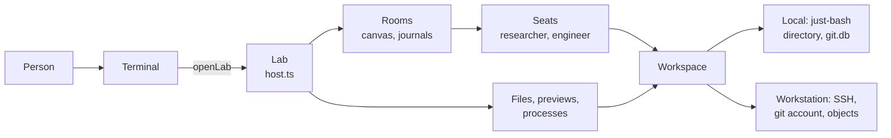

# The room host and the workspace

**This page is the source of truth for the room host and the workspace
(`src/host/`).** It states what `openLab` builds, how a room starts and
stops, which files each root holds, and what each backend can do. Update
this page with each change to a file of `src/host/`.

## Where each part lives

| Part             | Where                                                                                         | What it holds                                                                   |
| ---------------- | --------------------------------------------------------------------------------------------- | ------------------------------------------------------------------------------- |
| The host         | `src/host/host.ts`                                                                            | `openLab`, the `Lab` interface, and the delivery of a message                   |
| The rooms        | `src/host/rooms.ts`                                                                           | `openRooms`: runtime, canvas, workspace, and room views                         |
| The names        | `src/host/names.ts`                                                                           | `ROOM_NAME` and `MAX_GOAL`                                                      |
| The seats        | `src/domain/room.ts`                                                                          | `seats`, and `buildRoom`, the seeded room                                       |
| The team         | `src/domain/definitions.ts`                                                                   | `team`, which defines the specialists, and `people`                             |
| The model        | `src/domain/model.ts`, `src/host/unavailable.ts`                                              | `missingLogin`, and `unavailable`, the fallback execution                       |
| The seed         | `src/host/seed.ts`, `seed/`, `library/`                                                       | The files that a new workspace starts with                                      |
| The files        | `src/host/files.ts`                                                                           | The file list, the file read, and `attachFile`                                  |
| The previews     | `src/host/previews.ts`                                                                        | The snapshot ref and the commit ref, as the panel shows them                    |
| The backends     | `src/host/workstation.ts`                                                                     | `workstation.json`, the probe, and the SSH backends                             |
| The repositories | `src/host/repositories.ts`                                                                    | `labRepositories` and `templateRegistrations`                                   |
| The processes    | `src/host/processes.ts`                                                                       | The order and the output of a background process                                |
| The checks       | `test/host.test.ts`, `test/files-homes.test.ts`, `test/seed.test.ts`, `test/previews.test.ts` | Rooms, files, attachments, processes, and addressing                            |
| The workstation  | `test/workstation-config.test.ts`, `test/workstation.test.ts`                                 | The config and the probe, then the container. The second skips without a config |

## What `openLab` builds

**`openLab` returns a `Lab`, the host as the terminal sees it.** The `Lab`
runs in the process of the terminal, so no method of it is a network call.
`runEngine` in `src/terminal/app/tui.ts` calls `openLab` once. `src/main.ts`
calls `runEngine` with the data directory (`.data` by default) and the path
in `WORKBENCH_WORKSTATION`. The tests call `openLab` with a scripted
`stream`.

**The start runs in a fixed order, and a failure stops it.**

1. Read `workstation.json` when `workstation` is set. A bad file stops the
   start before any room opens.
2. Open `rooms.db` in the data directory. The journals and the canvas table
   `canvas_rooms` share this SQLite file.
3. Choose the backends, open the workspace `workbench`, and probe the
   workstation.
4. Write the seed, and register the templates and the notes on the git
   backend.
5. Open the canvas, load the team with its skills, and resume the rooms.
6. Create the room `build`, when `rooms.db` did not exist before the start.

**The `Lab` serves rooms, files, processes, and widgets.** `close` stops
every room and releases the storage. `src/host/host.ts` documents each
method.

**A file operation waits in one queue.** `withWorkspace` runs the
operations one after the other. It refuses new work once `close` starts,
with the error `The host is stopping.` `cancelProcess` skips the queue, so
a wait for the end of a process holds no file read.

## Rooms

**The canvas hosts the rooms, and each room keeps its own journal.** The
canvas row records the name, the goal, and whether the room runs. The
journal holds the messages, the exchanges, and the seats. `RoomView` adds
the status (`running` or `stopped`), the last 30 activities, and the
reason of each failed activation.

**A new data directory gets the room `build`.** `buildRoom` in
`src/domain/room.ts` holds its goal. The goal lists the phases of the FM
radio in order, from the kit and the first build to the firmware. A data
directory that has a `rooms.db` gets no `build` room.

**`/new <name> [goal]` calls `Lab.create`.** The room starts at once, with
both specialists seated.

- **The name:** `ROOM_NAME` is `^[a-z][a-z0-9-]{0,47}$`: a lowercase letter
  first, then lowercase letters, digits, and dashes, 48 characters at most.
- **The goal:** the host trims it. It has 1 to `MAX_GOAL` (2000)
  characters.
- **A duplicate:** a name that exists fails with `This room already exists.`

**`control` takes three actions, and `close` ends them all.**

| Call     | What it does                                                       |
| -------- | ------------------------------------------------------------------ |
| `resume` | Starts a stopped room from its journal                             |
| `stop`   | Ends the run of the room. Reads of its journal still work          |
| `abort`  | Cancels the open exchange. The room keeps running                  |
| `close`  | Stops every room and keeps each row, so the next open resumes them |

**A stopped room takes no message.** `join`, `leave`, `send`, and `dismiss`
fail with `Resume this room first.` A room that a person stopped stays
stopped across a restart. A room that ran when the host closed runs again.

**A restart keeps the journal and loses the memory of the host.** The
journal keeps the messages, the exchanges, and the seats with their
attention. The host holds the activity list, the failure reasons (100 at
most), and the step traces in memory. `activation` returns nothing for an
activation that another process ran.

**`send` needs a person who is in the room.** It needs a nonempty key and
text. The same key and text return the first exchange and add no message.
The host seats an unseated specialist at `named` when `to` names it, and
refuses a seat at `none`. A breakout room seats no other specialist
([Breakout rooms](breakouts.md)).

**A start without a login still runs.** `missingLogin` finds a model with
no sign-in. The host then gives every seat the `unavailable` execution.
Each activation fails at once with the cause `permanent` and the way to log
in. The room stays up, and each `RoomView` lists the seats in
`unavailable`. A test passes a `stream` and needs no login.

## Seats

**Every room seats both specialists.** `seats` in `src/domain/room.ts` sets
the attention: the Researcher at `named`, and the Engineer at `broadcast`.
The Engineer hears every message. The Researcher wakes on a directed say
from the Engineer or from the person (`@researcher`).

**`Lab.create` passes these seats to the canvas.** It sets `seating: false`.
The reserve is empty, so no seat needs the `seat` and `unseat` tools. `team`
in `src/domain/definitions.ts` defines each specialist once, and the `Lab`
lists them in `team` as the names that a message can address. A breakout
room seats the agents that its opener chose ([Breakout rooms](breakouts.md)).

**Workbench has one person.** The name is the name of the OS account that
runs the process (`people` in `src/domain/definitions.ts`). `join` and
`send` refuse another name with `Unknown person`.

## The workspace

**The workspace `workbench` is shared by every seat.** The host opens it
with an audit log and the room mirror. Each seat has a home at
`/home/<seat>`. The host account (`mirrorAgent`) writes the seed and the
attachments.

| Root           | Who writes                          | Who reads                       |
| -------------- | ----------------------------------- | ------------------------------- |
| `/library`     | The host, at every start            | Every seat                      |
| `/shared`      | Every seat. The host seeds `kit.md` | Every seat                      |
| `/attachments` | The host, with `Lab.attach`         | Every seat                      |
| `/home/<seat>` | The seat that owns it               | That seat. The host reads as it |

[`workstation/README.md`](../workstation/README.md) holds the modes and the
accounts that enforce this table. The local backend enforces none of it.

**The seed comes from the package.** `seedFiles` in `src/host/seed.ts` maps
`library/` to `/library/...` and `seed/` to the other paths, so
`seed/shared/kit.md` becomes `/shared/kit.md`. The host writes each file of
`/library` at every start, because the package owns it. It writes any other
file only when the workspace lacks it, so an edit stays.

**The file list reads the roots, then the homes.** `listFiles` walks the
roots as the host account, and each home as its seat.

- **The roots:** the walk reads up to 500 entries, breadth first. It skips
  `/dev` and the home of each seat. A root that fails to list fails the
  call.
- **The groups:** a file shows under its root, such as `/shared`. The local
  root is `/`, so the top folder of a file names its group.
- **The homes:** a home lists up to 200 files, and stops after 1000 entries.
  It leaves out any name that starts with a dot. A home that fails to list
  gives an empty group.
- **The roots by backend:** the local backend lists `/`. A workstation lists
  the `roots` of `workstation.json`, because each home has mode `0700`.

**The file read refuses what the panel must not show.** `readFile` takes an
absolute path with no empty, `.`, `..`, or NUL part. It refuses a hidden
part inside a home and a symbolic link in any part of the path. A path in a
home reads as the seat that owns it, matched by the whole name of the home.
Any other path reads as the host account.

| Kind     | Limit   | Past the limit                            |
| -------- | ------- | ----------------------------------------- |
| Text     | 128 KiB | `Preview supports files up to 128 KiB.`   |
| Database | 8 MiB   | `Preview supports databases up to 8 MiB.` |
| Picture  | 8 MiB   | `Preview supports pictures up to 8 MiB.`  |

A database shows as tables. A picture is a `.png`, `.jpg`, `.jpeg`, `.gif`,
or `.webp` file.

**`attach` copies a local file into `/attachments` and snapshots it.** It
returns a ref that a message can cite.

- The file is a regular file of up to 8 MiB. The host checks the size
  before and after the read.
- The name is `<time>-<file name>`, with a number prefix when the name is
  taken. No file overwrites another.
- A name that a ref cannot hold fails before the host writes anything.
  When the snapshot fails, the host removes the copy.

**A ref opens as a preview.** `snapshot` reads the bytes of a snapshot ref
from the object store, and the workspace checks the digest. It shows a
database as tables, a picture by the extension of the path, and text up to
128 KiB. Other binary bytes, and a database or picture over 8 MiB, give a
note. A ref of another workspace fails. `commit` shows the repository, the
branch or the tag, the hash, the author, the parents, the message, the
changed paths, and where the branch or the tag points now.

## The backends

**The workspace runs on one of two backends.** `workspaceBackends` in
`src/host/rooms.ts` picks one. `workstation.json` selects the workstation.

| Part             | Local (default)                              | Workstation                                        |
| ---------------- | -------------------------------------------- | -------------------------------------------------- |
| Shell and files  | just-bash, in `<data>/workspace`             | `bash` over SSH, one account and key for each seat |
| Git              | In process, in `<data>/git.db`               | The git account, over SSH on the server            |
| Processes        | Yes                                          | Yes, as the account of the seat                    |
| Sensor endpoints | None. `fetch` is absent                      | Yes. A seat reaches a sensor server with `fetch`   |
| Library write    | Nothing stops it. The next start rewrites it | The mode of `/library` stops it                    |
| Journals         | `rooms.db`                                   | `rooms.db` on the host machine                     |

**The local backend lacks some commands.** The just-bash `git` has no
`merge -s` and no `--no-commit` (`docs/notes.md`). With no sensor endpoint,
a viewfinder reports `This workspace cannot read a process, so it has no
camera.` A skill macro that calls `fetch` needs a backend with
endpoints (`docs/skills.md`).

**`workstation.json` configures the workstation.** `loadWorkstation` reads
it, and an error names the missing field. It holds `host`, `port` (22 by
default), `hostKey` (the SHA-256 fingerprint), `keys` (a folder with one
key for each account, relative to the file), `gitAccount`, `layout` (the
`audit`, `rooms`, and `snapshots` folders), `roots`, and an optional
`objects` block for an S3 store. `objects.credentials` names an env file
beside `workstation.json`, so the config holds no secret. Without
`objects`, the workstation keeps the snapshots in `layout.snapshots`.

**The probe names the cause of an SSH failure.** `probeWorkstation` makes
the first operation as the host account. A failure names the server, the
host account with its key, the git account with its key, and the SSH error.
`workstation/setup.sh` writes `workstation.json`, and `make` runs it
([`workstation/README.md`](../workstation/README.md)).

## Repositories and templates

**The host registers the templates and the notes on the git backend.**
`templateRegistrations` maps each entry of `src/domain/templates.ts` to its
files. `labRepositories` builds the local backend with these and with
`sharedRegistrations()`, the notes. `workstationBackends` gives the same
registrations to `workstationGitBackend`. The start lists the repositories
once, so a registration that fails stops the start with an error that names
it. [Templates and the git backend](templates.md) holds the pattern, and
[Notes](notes.md) holds the notes.

## Processes

**The host sees a background process through the process table of the
workspace.** A seat starts one with `bash`.

- **The list:** `processes` returns the running processes first, then the
  newest start first (`byRecency`).
- **The output:** `processOutput(handle, agent)` reads the output file as
  the owner. It returns the last 65 536 characters, cut after the first line
  break. An output over 1 MiB gives its size and no text. A file that does
  not exist yet reads as empty.
- **The cancel:** `cancelProcess` stops one process and returns its state.
- **The watch:** `watchProcesses` calls back when a process starts and when
  one ends.

**The viewfinder reads a shown `frame` widget of a room.** `docs/sensors.md`
holds the viewfinder and its limits.
