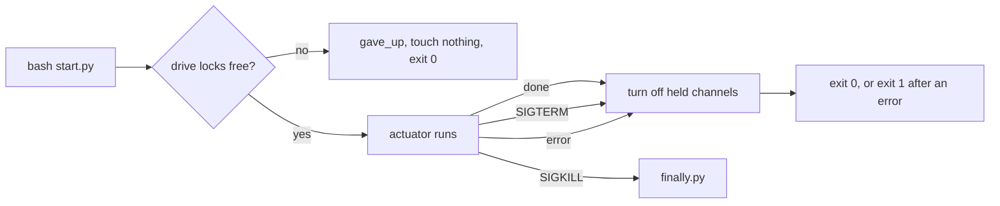

# Sensors and devices

**This page is the source of truth for the rules that a bench template
follows to serve sensors and to drive devices.** It also holds the way the
host shows a camera. [Situation awareness](awareness.md) holds what each
sensor captures, how long it keeps the data, and how a seat reads it. Update
this page with each change to a protocol check, a lock, or the viewfinder.
The checks live in `test/sensor-protocol.ts` and `test/*-protocol.test.ts`.

## The templates

| Template      | Serves                                               | Drives                                 | README                                       |
| ------------- | ---------------------------------------------------- | -------------------------------------- | -------------------------------------------- |
| `device-scan` | Nothing. One scan writes a report                    | Nothing                                | [README](../templates/device-scan/README.md) |
| `usb-camera`  | `camera` and `microphone`, from `camera.py`          | Nothing                                | [README](../templates/usb-camera/README.md)  |
| `psu`         | `output`, `recent`, and `settings`, from `sensor.py` | A supply, with `psu.py` and `start.py` | [README](../templates/psu/README.md)         |

## A sensor server

**A sensor server is a process that a seat starts in the workspace.** It
serves the Ambion sensor protocol, version 2, over HTTP. The Ambion
[sensor page](https://github.com/ambionframework/ambion/blob/main/examples/workbench/docs/sensors.md)
defines the protocol. The seat reads the server with `fetch` and the handle
of the process. The workspace keeps what `fetch` reads as a snapshot.

| Method | Path                        | Answer                                            |
| ------ | --------------------------- | ------------------------------------------------- |
| `GET`  | `/`                         | `api`, the `source`, and each sensor with `spans` |
| `GET`  | `/<sensor>/observe`         | The latest observations of the sensor             |
| `GET`  | `/<sensor>/observe?from&to` | The observations of a span, when `spans` is true  |
| `GET`  | `/files/<sha256>`           | The bytes of the file that the digest names       |

**`test/sensor-protocol.ts` enforces these checks on each server.**

- **Index.** Status 200, the content type `application/json`, `api` 2, the
  fork ID in `source.repository`, and the exact list of sensors with their
  `spans` flags. Each sensor has a description.
- **Observation.** Status 200 and `api` 2. Each `at` is UTC with three digits
  of milliseconds. Each observation has at least one part.
- **Span.** A valid `from` and `to` give status 200 when `spans` is true.
  They give 422 with the code `unavailable` when `spans` is false.
- **Malformed span.** A lone `from`, a lone `to`, a reversed span, an empty
  span, a date with no time, and an extra parameter give 400 with the code
  `invalid`.
- **Unknown.** An unknown sensor, path, or file digest, and a `POST`, give
  404 with the code `unknown`.
- **Error body.** JSON with `api` 2, a `code`, and a text `message`.
- **File.** Status 200, and the SHA-256 of the bytes equals the digest in the
  path.

The checks do not test the content type of a file. `camera.py` sends
`image/png` or `audio/wav`. `sensor.py` sends `application/json`. A span is
half open: `from` is in and `to` is out.

**Both servers follow one launch rule set.**

- **Port.** The server binds `127.0.0.1` on `$PORT`. The workspace sets
  `PORT` for each process that `bash` starts. The server exits when `PORT`
  is absent.
- **Source.** `AMBION_SENSOR_REPOSITORY` holds the fork ID. The server reads
  the commit, the branch, and the dirty flag once at start. It needs a git
  checkout and exits with code 2 without one.
- **Data.** `AMBION_SENSOR_DATA_DIR` is an absolute directory outside the
  checkout. A file in `blobs/<sha256>` is written through a temporary file
  and then renamed.
- **Start.** The server prints no ready line. It listens after its first
  usable read, so `fetch` fails until then.
- **End.** The server runs in the foreground, and `SIGTERM` stops it. A
  seat replaces it with `cancel`, an edit, a push, and a new `bash` call.
  The new process receives a new port.

**Only the workstation backend lets a seat read a sensor server.** The local
backend has no sensor endpoints, and `fetch` is absent
([Host](host.md)). The Python tests and the shared checks need no backend.
They need `python3` 3.11 or newer.

## Devices and their writers

**A sensor reads a device. A controller or an actuator writes to it.**
`sensor.py` calls only the read methods of the guard: `describe`, `measure`,
`settings`, and `mode`. It takes no drive lock, so it runs beside a
controller. The guard (`templates/psu/guard.py`) enforces the limits and the
locks.

| Actor               | May write | Locks                                                        |
| ------------------- | --------- | ------------------------------------------------------------ |
| `sensor.py`         | No        | None                                                         |
| `psu.py set/output` | Yes       | The drive lock of the channel, held for the call             |
| `start.py` actuator | Yes       | The drive lock of each channel, held until exit              |
| `finally.py`, `off` | Turn off  | None. A turn-off works while another process holds a channel |

**The guard refuses a value above a limit before it writes.** A limit is the
smaller of the value in `psu.json` and the rating of the driver.

**Two kinds of lock keep processes apart.** Both use `flock` on a file in
`PSU_LOCK_DIR`, else `/run/lock` when the account can write there, else
`/tmp`.

- **The bus lock** `<name>.bus` orders the calls to the driver. A call waits
  for it.
- **The drive lock** `<name>.<channel>.drive` names the one process that
  changes a channel. A call that needs it refuses at once and names the
  holder. `sensor.py` reads the holder and shows it as the drive owner.

**The Engineer rules add two limits** (`src/domain/definitions.ts`). The
Engineer changes a device only through a script from a template. In a root
room, it asks the person before the first run that turns on an output.

## The lifecycle of a controller

**A controller is a `start.py` actuator that runs as a process.** It takes
the drive locks, drives the channels, and turns them off at its end. Ambion's
[actuator page](https://github.com/ambionframework/ambion/blob/main/examples/workbench/docs/actuators.md)
holds the contract. `templates/psu/controller.py` implements it. The README
of the template holds the commands, the options, and the event log.

- **Start.** The seat starts the controller with `bash`, a `name`,
  `grace: 5`, and a `timeout` above the run time.
- **Locks.** The controller takes the drive lock of each channel without
  waiting. It takes all locks or none.
- **Stop.** `SIGTERM` and `SIGINT` set a flag. The actuator checks the flag
  between device calls, and a wait sleeps in slices of `SLICE`.
- **End.** After the controller opens the supply, every end turns off the
  channels that the process holds. This includes a refused option and an
  error.
- **Exit 0** means that every channel the process holds is off. **Exit 1**
  means an error, and the state of the channels is unknown.
- **`finally.py`** turns off the outputs after an exit other than 0, a
  `cancelled` state, a kill, or a lost process. It takes no drive lock and
  needs no state. A second run changes nothing. It exits 1 when a channel
  stays on.

A sensor server does not feed a controller. The controller reads its own
driver, and the seat confirms the result through a sensor.

## The camera on screen

**The Engineer shows a camera with a `frame` widget.** `FRAME_KIND` in
`src/host/viewfinder.ts` has the name `frame`, the source type `process`,
and `actions: true`. `src/host/rooms.ts` registers it on the canvas. Only the
Engineer holds `show` and `hide`. After the camera server answers, the
Engineer calls `show` with a `name`, `kind: 'frame'`, a `source` of the
`handle` and the `path` (`/camera/observe`), a `title`, and `actions`.
`skills/engineer/observe-the-camera/SKILL.md` holds the steps. The Engineer
does not call `show` in a breakout room. [Terminal](terminal.md) holds the
drawing of the camera.

**`openViewfinder` binds each shown `frame` widget to its process.** The host
makes one viewfinder for each room. The viewfinder reads the widgets of the
room at its start, on the `started` and `answered` events, and on each
`widget` event.

- **Binding.** One binding for each widget name, up to `MAX_BINDINGS`. A
  bound widget keeps its place. The viewfinder names the rest in a note.
- **Check.** A binding lists the running processes of the widget author once,
  and follows the handle only when it finds it. A failed list runs again.
- **Show again.** A `show` with another author, handle, or path drops the
  old frame and checks the new handle. A new title only redraws.
- **Hide.** A `hide` closes the binding and aborts its read.
- **End of process.** The `ended` event of the bound process clears the
  frame. The binding waits for a new `show`.

**A binding polls the process every `POLL_MS` with `workspace.fetch`.** One
read runs at a time. A poll reads `GET <path>`, takes the first `frame` part
of the last observation, and reads `GET /files/<digest>`. A frame with the
digest of the last frame needs no download. A downloaded frame must match
its digest. The workspace keeps no snapshot of these reads.

| Constant                | Value     | Effect                                   |
| ----------------------- | --------- | ---------------------------------------- |
| `POLL_MS`               | 3 000 ms  | The time between two polls of one camera |
| `TIMEOUT_MS`            | 10 000 ms | A read that takes longer aborts          |
| `MAX_OBSERVATION_BYTES` | 1 MiB     | A larger observation is a failed read    |
| `MAX_FRAME_BYTES`       | 16 MiB    | A larger frame is a failed read          |
| `MAX_BINDINGS`          | 4         | The viewfinder ignores the other widgets |

The size limits apply to `Content-Length` and to the bytes that arrive.

**Each camera has a note for the person.** A failed read keeps the last
frame and sets the note. The next good read clears it.

| Situation                                          | Text                                                                        |
| -------------------------------------------------- | --------------------------------------------------------------------------- |
| Before the first frame (`STARTING`)                | Reading the camera.                                                         |
| No widget is shown (`NO_CAMERA`)                   | No camera is shown. Ask the Engineer to show the camera.                    |
| The author does not run the handle (`NOT_RUNNING`) | The camera process does not run. Ask the Engineer to show the camera again. |
| The bound process ended (`LOST`)                   | The camera process ended. Ask the Engineer to show the camera again.        |
| The backend has no `fetch` (`NO_ENDPOINTS`)        | This workspace cannot read a process, so it has no camera.                  |
| The server answers outside 2xx                     | The camera answered 503, with the `message` of the server when it has one   |
| More than `MAX_BINDINGS` widgets                   | The viewfinder shows 4 cameras at most. Not shown: the names                |
| Another version, no frame, a bad digest, a timeout | A line that names the cause                                                 |

**`frameActions` in `src/host/actions.ts` lists the buttons of the cameras.**
It keeps a shown `frame` widget that has at least one action with no form.
Each entry holds the room, the name, the revision, the actions, the person
in `for`, and the `answered` act of that revision. The host exposes it as
`actions(room)`. `host.act` sends a press to the canvas, which checks it and
posts it as a message of the person. The skill tells the Engineer to answer
with a new observation. The terminal draws the buttons.

## Add a sensor

1. **Choose the name and `spans`.** A name matches `[a-z]+`. Set `spans`
   to true only when the server answers a span from stored data.
2. **Add it to the index.** In `sensor.py`, add a row to `SENSORS` and a case
   to `Sensor.observe`. In `camera.py`, add the sensor to `Camera.sensors`.
3. **Return observations.** Give each one an `at` in UTC with milliseconds
   and at least one part. Write a file to `blobs/<sha256>` and name it by
   digest. Add a `frame` part if the viewfinder must show it.
4. **Keep the sensor read-only.** A sensor takes no drive lock and writes
   no setpoint.
5. **Add the Python tests** in `templates/psu/tests/test_sensor.py` or
   `templates/usb-camera/test_camera.py`. Test the data, the 400, 404, 422,
   and 503 cases, and a start with no `PORT` or no checkout.
6. **Add the protocol test.** Add the sensor to the `SENSORS` list of
   `test/psu-sensor-protocol.test.ts` or `test/usb-camera-protocol.test.ts`.
   The shared checks run on it. Add one test for the bytes of its
   observation and of each file.
7. **Update the pages.** Edit the README of the template, the sensor table of
   [Situation awareness](awareness.md), and the skill that starts the server.
8. **Run the tests.** Run `python3 -B -m unittest` in the template, run
   `pnpm exec vitest run test/<name>.test.ts` on the protocol test, and run
   `pnpm check` before you finish.

A new template needs more: follow [Templates](templates.md), add its
directory to `suiteDirectories` in `scripts/check.ts`, and add its name to
the ignore-file test in `test/templates.test.ts`.
