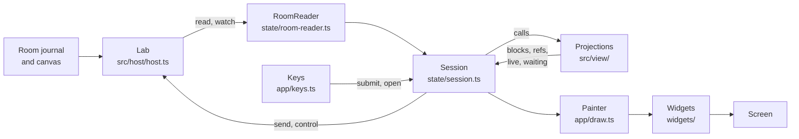

# The terminal

**This page is the source of truth for the terminal (`src/view/` and
`src/terminal/`).** It states how the journal of a room reaches the screen,
how the dock and the keys work, and what a person sees and presses. Update
this page with each change to a file of those two folders.

**The page has two parts.** "Design" is for a contributor. "Use" is for a
person at the keyboard. The terminal reads the host through the `Lab`
interface. [Host](host.md) holds that side, and [Sensors](sensors.md) holds
the camera server that the viewfinder reads.

## Where each part lives

| Part              | Where                                    | What it holds                                                          |
| ----------------- | ---------------------------------------- | ---------------------------------------------------------------------- |
| The projections   | `src/view/`                              | Pure functions of the room record: blocks, steps, refs, live work      |
| The state         | `src/terminal/state/`                    | The session, the readers, the browsers of the layers, the voice rules  |
| The widgets       | `src/terminal/widgets/`                  | OpenTUI boxes that draw state, and the layout of the screen            |
| The app           | `src/terminal/app/`                      | The wiring, the painter, the key router, the dock, the voice devices   |
| The keys          | `src/terminal/state/keymap.ts`           | `KEYMAP`, the one table of every key. The keys sheet draws it          |
| The commands      | `src/terminal/state/commands.ts`         | `COMMANDS`, the parser, and the rows of the palette                    |
| The spacing scale | `src/terminal/widgets/space.ts`          | `GUTTER`, `INSET`, `GAP`, `APART`, `SCROLLBAR`, `TRACK`, `edgeRows`    |
| The colors        | `src/terminal/widgets/brand.ts`          | The product name and the dark palette                                  |
| The import rules  | `biome.jsonc`, [CLAUDE.md](../CLAUDE.md) | One `noRestrictedImports` override for each layer                      |
| The view checks   | `test/timeline.test.ts` and others       | `steps`, `live`, `steering`, `refs`, `system`, `tool-phrases`, `text`  |
| The state checks  | `test/session.test.ts` and others        | `room-reader`, `feed`, `refs-session`, `status-row`, `title`, `layers` |
| The widget checks | `test/panels.test.ts` and others         | `transcript`, `row-diff`, `header`, `thumbnails`, `attachments-ui`     |
| The app checks    | `test/panel-keys.test.ts`                | The keys, the dock, and the layers, over `test/fake-host.ts`           |
| The voice checks  | `test/voice.test.ts` and others          | `voice-fakes`, `whisper`, `whisper-server`, `speech`, `kokoro`         |

## Design

### From the journal to the screen

**The data goes one way, from the journal to the screen.** The host reads
the journal and the canvas. The state reads the host and calls the
projections of `src/view/`. The painter draws the blocks that the state
holds. A key goes the other way: the key router calls the state, and the
state calls the host.

**A change of the open room reaches the screen in seven steps.**

1. The host calls `changed` after each entry that a running room records and
   after each activation step (`Lab.watch`). `RoomReader.select` sets the
   watch.
2. `RoomReader.refresh` reads the room with `Lab.read(room, since)`. A call
   during a read asks for one more read, so many changes cost at most two
   reads (`coalesced` in `state/coalesce.ts`).
3. `RoomFeed` merges the new messages by `seq` and moves the cursor. A
   counter of generations drops the result of a read for a room that the
   person left.
4. `Session.applyView` keeps the `RoomView`. It reads the steps of the
   activations (`readSide`) and starts the process tails of the running
   seats.
5. `Session.rebuild` calls `buildTimeline` and keeps the result in
   `Session.blocks`.
6. `Session` calls `changed`, which is `EngineTui.render` in `app/tui.ts`.
   It places the dock and calls the painter.
7. `Painter.render` draws the transcript only when its signature changed.
   It then draws the header, the composer, and the top layer of the dock.

**Other sources wake a read, and each has its own trigger.**

| Source          | Trigger                                          | What it reads                                                                                 |
| --------------- | ------------------------------------------------ | --------------------------------------------------------------------------------------------- |
| Room watch      | Each entry and each activation step              | The open room                                                                                 |
| Room-list watch | A room opens, starts, stops, or is archived      | The room list (`Lab.watchRooms`, `Session.listRooms`)                                         |
| Slow poll       | Every 4 s (`SLOW_MS` in `app/tui.ts`)            | The room list and the root files. The open room only while it is stopped. The processes layer |
| Process count   | A process starts or ends (`ProcessCount`)        | The process table, for the status row                                                         |
| Process tails   | Every 1 s while a seat of the open exchange runs | The output of the processes of that seat                                                      |
| Clock           | Every 1 s while a seat works (`Ticker`)          | Nothing. It repaints the time of the status row                                               |
| Viewfinder tick | Every 1 s while the camera layer draws frames    | Nothing. It repaints the age of each frame                                                    |

### The view

**The view turns the record into plain data.** It holds no state and draws
nothing. It imports no file of `domain`, `host`, or `terminal`. The host
imports it too, for `stepLog`, `WORKSPACE`, and the database preview.

| Module            | What it projects                                                               |
| ----------------- | ------------------------------------------------------------------------------ |
| `timeline.ts`     | `buildTimeline`: messages and exchanges into blocks                            |
| `steps.ts`        | `stepsView`: a trace into passes with lines. `stepLog` keeps the traces        |
| `live.ts`         | `liveActivations`, `workingOf`, `totalsOf`, and `endedLine`                    |
| `steering.ts`     | `waitingMessages`: the messages of the person that a running seat did not read |
| `refs.ts`         | `resolveRef`, `refItems`, `citedFiles`, and `pickIds`                          |
| `system.ts`       | `systemRow`: the folded row of a system message                                |
| `tool-phrases.ts` | `callPhrase`, `resultPhrase`, and `failurePhrase`: a tool call as one line     |
| `text.ts`         | `ellipsize`, `ellipsizeMiddle`, `brief`, `firstLine`, and `clock`              |
| `database.ts`     | `readTables`: a SQLite file into tables for the files layer                    |

**`buildTimeline` makes six kinds of block.** A `message` block holds one
message with its role: `question` (from a person), `said`, or `system`. A
run of system messages joins into one `system` block. A `stays` block holds
the folded activations of closed exchanges. A `note` block ends a closed
exchange that waits on a person or that the room gave up on. A `steps`
block holds the trace that `/steps` asked for. The `live` block ends the
list while an exchange is open.

**A ref is untrusted text from a seat.** `resolveRef` accepts four forms:
`file:///<path>`, a snapshot ref, a commit ref, and a message ref. It checks
each against the lists that the host gave (`Known`). A ref that fails the
check opens nothing, and its chip says why. No ref reaches a host file
without that check.

**A tool without a phrase shows its name and its input.** `TOOLS` in
`tool-phrases.ts` maps a tool name to an icon, words from the input, and
optionally a short result and a short failure. A tool with no entry still
shows.

### The state

**The state holds everything that is not drawing.** It imports no OpenTUI,
no widget, and no app file. A test builds it over a fake host
(`test/fake-host.ts`) with no renderer.

| Group    | Files                                                                                     | What it does                                        |
| -------- | ----------------------------------------------------------------------------------------- | --------------------------------------------------- |
| Session  | `session.ts`, `session-text.ts`, `attention.ts`, `dismiss.ts`, `breakouts.ts`             | The person, the rooms, the commands, the room list  |
| Reading  | `room-reader.ts`, `feed.ts`, `coalesce.ts`, `ticker.ts`                                   | The open room, read as often as it changes          |
| Composer | `commands.ts`, `audience.ts`, `cue.ts`, `status-row.ts`, `title.ts`, `attachments.ts`     | What the input reaches, and the text around it      |
| Keys     | `keymap.ts`, `mode.ts`                                                                    | `KEYMAP` and the four modes                         |
| Layers   | `layers.ts`, `browser.ts`, `process-browser.ts`, `viewfinder-browser.ts`, `action-pad.ts` | The stack of the dock and the state of each layer   |
| Counts   | `process-count.ts`, `process-tails.ts`                                                    | The processes for the status row and the live block |
| Pictures | `pictures.ts`, `picture-cache.ts`                                                         | The thumbnails under a message                      |
| Voice    | `voice.ts`, `speech.ts`                                                                   | The rules of voice mode and of spoken replies       |

**`RoomReader` reads the open room as often as it changes.** It owns one
`RoomFeed` and one watch. `select(room)` drops the messages of the old room,
ends the old watch, and sets a watch on the new room. Each watch call starts
`refresh`. A read hands the room view to `apply` in the same request. An
error of the read or of `apply` goes to `failed`, which sets
`Session.offline`. `stop()` ends the watch.

**`Session` is the one object that the app talks to.** It holds the person,
the room list, the files, the open room and its `view`, the `blocks`, the
notice, the error, and the files browser. It calls the host directly. After
each change it calls the `changed` function that the app gave it.

- **`start`:** sets the room-list watch, starts the process count, reads the
  rooms and the files with the homes, and enters the first running room.
- **`switchRoom`:** drops the state of the old room: the view, the blocks,
  the focus, the steps, the folds, the tails, the notice, and the staged
  attachments. It then selects the new room in the reader, leaves the old
  room, joins the new one, and reads.
- **`submit`:** reads a goal, a message, or a command with `parse`. A
  command handler returns an `Intent` (`quit`, `files`, `processes`,
  `camera`, `voice`, or `compose`) for the app to apply. The `handlers`
  table has one entry for each name in `COMMANDS`, and the compiler checks
  it.
- **`send`:** refuses when a send is in flight, no person or room is open,
  the room is archived, or the room is stopped. Else it calls `Lab.send`
  with a new key, the staged refs, and the named seat. A failed send keeps
  the staged files.
- **`readLive`:** keeps the full steps of the open exchange. For an
  activation of a closed exchange, it keeps only the totals (the calls and
  the span). The line of that activation reads the full trace again when the
  person expands it.
- **`poll`:** the slow fallback. It reads the room list and the root files.
  It reads the open room only while the room is stopped.
- **`leave`:** ends the watches and the timers, and ends the visit of the
  person.

**The state keeps small pure helpers for the composer.** `status-row.ts`
fits the segments of the status row by priority. `title.ts` builds the
window title. `audience.ts` tells which seats a text reaches. `cue.ts`
builds the lines above the input. A test drives each of them with plain
values.

### The widgets

**A widget draws state and keeps no state of the room.** It imports state,
view, and OpenTUI. It imports no app file.

| Widget       | File                                                                         | What it draws                                                      |
| ------------ | ---------------------------------------------------------------------------- | ------------------------------------------------------------------ |
| `Transcript` | `transcript.ts`                                                              | The blocks. It keeps one node for each block, by signature         |
| `Composer`   | `composer.ts`                                                                | The chip, the input, the palette, the cue, and the status row      |
| `Palette`    | `palette.ts`                                                                 | The picked row of the command palette                              |
| `Header`     | `header.ts`, `header-fit.ts`                                                 | The room path, the goal, the person, and the participants          |
| `DockPanel`  | `dock.ts`                                                                    | The box at the right: tabs line and the top layer                  |
| `SidePanel`  | `side-panel.ts`                                                              | The base of a layer: a scrolling body, a message line, a clipboard |
| Layer panels | `files-panel.ts`, `process-panel.ts`, `viewfinder-panel.ts`, `keys-panel.ts` | One class for each layer                                           |
| `ActionRows` | `action-rows.ts`                                                             | The buttons under a camera                                         |
| Pure helpers | `file-list.ts`, `row-diff.ts`, `markdown-style.ts`                           | The lines of the files list, the row plan, the Markdown style      |

**`Transcript.render` keeps the nodes that did not change.** Each block has
a signature that holds the block, its refs, the chosen ref, the focus, the
fitted width, and its strips. `planRows` finds the rows that are equal at
the top and at the bottom, and it keeps the equal rows between them. The
transcript builds the other rows. It then puts the scroll back: at the end
when it was there, at the same line when it was not, or at the node that the
caller asks to reveal.

**The composer takes a pasted picture path.** `PasteAwareTextarea` offers a
pasted line to `pastedImagePath`. A path of a picture into an empty
composer fills `/attach <path>` and consumes the paste.

### The app

**The app wires the parts, draws them, and routes the keys.** The session
holds the state, and the app holds no state of the room.

| File                                               | What it does                                                                        |
| -------------------------------------------------- | ----------------------------------------------------------------------------------- |
| `tui.ts`                                           | `runEngine`: opens the host and the renderer, builds `EngineTui`, runs it           |
| `draw.ts`                                          | `Painter`: reads the session and draws the header, the transcript, and the composer |
| `keys.ts`                                          | `Keys`: the mode, the chosen ref, and the route of each key                         |
| `dock.ts`                                          | `Dock`: the stack of layers and the placement of the box                            |
| `surface.ts`                                       | `Surface`: the interface of one layer                                               |
| `*-surface.ts`                                     | The files, processes, keys, and camera layers                                       |
| `keyboard.ts`                                      | The Kitty keyboard flags, and the check for voice mode                              |
| `microphone.ts`, `whisper.ts`, `whisper-server.ts` | The devices of voice mode: the recorder and the transcriber                         |
| `kokoro.ts`, `kokoro-server.ts`, `speaker.ts`      | The devices of spoken replies: the engine and the player                            |

**`runEngine` is the only entry.** `src/main.ts` calls it with the data
directory, the person, and the path of `workstation.json`. It calls
`openLab` and creates the renderer. The renderer asks for the Kitty keyboard
events and a target of 30 frames each second. `EngineTui` then builds the
widgets, the session, the four surfaces, the dock, the painter, the key
router, and voice mode. When the renderer ends, the app stops the keys,
voice mode, and the timers. It then stops the whisper server and the Kokoro
server, ends the visit of the person, and closes the host.

### The three layers and the import rule

**`domain` and `view` are leaves. `host` imports both. `terminal` may
import the other three.** Biome holds the rule with one `noRestrictedImports`
override for each layer in `biome.jsonc`.

| Layer                   | May not import                          | Why                                           |
| ----------------------- | --------------------------------------- | --------------------------------------------- |
| `src/view/`             | `domain`, `host`, `terminal`, `main.ts` | It formats the record for display             |
| `src/terminal/state/`   | OpenTUI, `widgets/`, `app/`, `main.ts`  | It draws nothing, so a test needs no renderer |
| `src/terminal/widgets/` | `app/`, `main.ts`                       | A widget draws state. The app wires widgets   |
| `src/terminal/app/`     | `main.ts`                               | The entry point composes the terminal         |

**Each layer has its own kind of test.** A view function takes plain
records, so its test passes records. A state class takes a host, so its test
passes `FakeHost` (`test/fake-host.ts`). A widget test draws on the headless
renderer of OpenTUI (`createTestRenderer`). Cognitive complexity is 10 at
most in source and 15 in tests.

### The dock

**The dock is one box at the right of the conversation, with a stack of
layers.** `LAYERS` in `state/layers.ts` names them: `files`, `processes`,
`keys`, and `camera`. `LayerStack` keeps them in order of recency.

- **Open:** `Dock.open` raises the layer. A layer that was closed opens on
  fresh state, and the layer that was on top stops its work. A layer that
  was open keeps its state.
- **Top:** only the top layer draws and runs its work. `Dock.layout` starts
  the work of the top layer and stops the work of the others.
- **Close:** closing the top layer shows the layer that was on top before.
- **Tabs:** the tabs line keeps the order of `LAYERS`, so a tab does not
  move when its layer rises. `Dock.cycle` shows the next tab.

**The width of the terminal decides where the dock draws.** `NARROW` in
`app/dock.ts` is 100 columns. At or above it, the box sits beside the
conversation and takes half of the width, 40 columns at least
(`DockPanel`). Below it, a layer fits only when its surface has
`narrow: true`, which the files, processes, and keys layers have. A narrow
terminal draws the dock over the conversation, 80% wide, and only while the
dock has the keys. The camera layer has `narrow: false`, so a terminal under
100 columns never shows it.

| Layer       | Surface                 | State                               | Panel             | Takes keys | Work                                                                           |
| ----------- | ----------------------- | ----------------------------------- | ----------------- | ---------- | ------------------------------------------------------------------------------ |
| `files`     | `files-surface.ts`      | `FileBrowser`, through the session  | `FilesPanel`      | Yes        | Loads the preview as the choice moves                                          |
| `processes` | `process-surface.ts`    | `ProcessBrowser`                    | `ProcessesPanel`  | Yes        | Watches the process table. Follows the output of a running process each second |
| `keys`      | `keys-surface.ts`       | None                                | `KeysPanel`       | Yes        | None                                                                           |
| `camera`    | `viewfinder-surface.ts` | `ViewfinderBrowser` and `ActionPad` | `ViewfinderPanel` | No         | Opens a viewfinder on the host, and redraws the age of each frame each second  |

**A Kitty picture draws above every cell.** While the dock covers the
conversation, the painter draws no thumbnail, so none shows through the
dock.

**A new layer takes four steps** (`app/surface.ts`). Write a class that
implements `Surface`. Add its id to `LAYERS`. Add it to the table of
surfaces in `tui.ts`. Add an `open` method to `Keys` and an `Intent` to
`Session` for the command that opens it.

### Who holds the keys

**One mode at a time holds the keys.** `Mode` in `state/mode.ts` has four
values. `Keys` in `app/keys.ts` holds the current one.

| Mode      | Who holds the keys                  | How it starts                                                 | How it ends                                          |
| --------- | ----------------------------------- | ------------------------------------------------------------- | ---------------------------------------------------- |
| `compose` | The composer and its palette        | The start of the terminal                                     | Tab, Ctrl+L, Ctrl+O, or a layer that takes the keys  |
| `refs`    | The pick over refs, rows, and lines | Tab in the composer, with the palette closed                  | Esc, `r`, or Tab. It ends when nothing can be picked |
| `actions` | The `ActionPad` of the camera layer | Ctrl+L, while the camera is on top and a camera has an action | Esc or `q`, Ctrl+C, or when no action is left        |
| `dock`    | The top layer                       | A layer that takes keys opens, or Ctrl+O in the composer      | Esc, `q`, Ctrl+O, Ctrl+C, or when no layer shows     |

**`Keys.onKey` routes each key in a fixed order.**

1. `controlKey` takes Ctrl+C and Ctrl+D in every mode. Ctrl+C drops a
   recording first. Else it closes the top layer in `dock` mode, leaves
   `actions` mode, or clears the composer. Ctrl+D leaves the terminal on
   the second press within `QUIT_WINDOW_MS` (2 s), from an empty composer in
   `compose` mode.
2. `voiceKey` takes Space in `compose` mode when voice mode wants it. The
   dock and the refs use Space themselves. It takes F13 in every mode,
   because no other part uses F13.
3. In `dock` mode, `dockKey` takes the keys of the `dock` scope (Ctrl+O,
   Tab, Ctrl+L). The top layer gets every other key.
4. Page Up and Page Down scroll the conversation in the other modes.
5. The key goes to the `ActionPad`, the refs, or the composer, by mode.

**The camera layer leaves the keys with the composer.** The files,
processes, and keys layers set `takesKeys`, so opening one blurs the
composer and sets `dock` mode. The camera layer sets it to false.
`Keys.reconcile` runs at each draw. It drops a pick that no longer exists.
It returns the keys to the composer when `refs` or `dock` mode has nothing
left to work on.

**`KEYMAP` is the one table of keys.** A handler reads its keys through
`actOf(scope, key)`. The keys sheet draws the same table, so the two cannot
differ. A handler table has the type `Record<Act<scope>, ...>`, so a binding
without a handler does not compile. To add a key, add a binding to its
section in `keymap.ts`, then add the handler.

**The terminal asks for the Kitty keyboard events.** `KEYBOARD` in
`app/keyboard.ts` sets `events: true`, which reports the release of a key.
The flags leave out "all keys as escape codes", because macOS then reports a
character that Option types as an Alt key.

### The spacing scale

**New layout takes its distances from `widgets/space.ts`.** A cell is about
twice as tall as it is wide, so a gap of one row and a gap of two cells look
alike. No lint rule or test enforces the scale. A reviewer checks it. When a
layout needs a new distance, add a named constant to the file with a comment.

| Constant         | Value  | Use                                                                  |
| ---------------- | ------ | -------------------------------------------------------------------- |
| `GUTTER`         | 1      | Cells between a rail, a border, or the window edge and the text      |
| `INSET`          | 2      | The column where text starts inside a block: a rail, then the gutter |
| `GAP`            | 1      | Blank rows between two blocks                                        |
| `APART`          | 2      | Cells between two texts on one row                                   |
| `SCROLLBAR`      | 2      | Cells that keep text clear of a scrollbar                            |
| `TRACK`          | 1      | Cells that the track of a scrollbar takes                            |
| `edgeRows(rows)` | 0 or 1 | Blank rows at the top and at the bottom: `GAP` from 30 rows up       |

### Voice

**`Voice` in `state/voice.ts` holds the rules and no device.** The app gives
it the parts (`VoiceParts`). They are the recorder, the transcriber, the
check that voice mode can run, the name of the place that a message goes
to, and the send. A test passes fakes (`test/voice-fakes.ts`).

The send calls `Session.submit(text, { voice: true })`. A transcript that
parses as a message then starts with `VOICE_MARK` (`src/domain/voice.ts`),
so the specialists know that the person spoke. A command gets no mark.

- **The hold:** Space on an empty composer starts a recording. F13 starts
  one with any composer, and F13 types no text. A foot pedal sends F13
  (`make pedal` programs it). The release of either key ends the hold. A
  hold under `MIN_HOLD_MS` (300 ms) sends nothing. A hold ends at
  `MAX_HOLD_MS` (60 s). A terminal repeats a held Space with no flag, so a
  Space within `HOLD_GAP_MS` (2.5 s) of the last one belongs to the hold.
  Kitty flags the repeat of F13 (`repeated`), and the same gap applies.
  When voice mode is off, a new press of F13 shows "Voice mode is off.
  /voice turns it on." and changes nothing else.
- **The release:** `Keys.onRelease` calls `Voice.release` in every mode,
  because the hold can outlast a mode change. Only a terminal with Kitty key
  events reports a release, so `keyboardProblem` refuses voice mode
  elsewhere.
- **The recorder:** `app/microphone.ts` records mono audio at 16 kHz into a
  temporary WAV file with the audio engine of OpenTUI.
- **The transcriber:** `app/whisper-server.ts` starts `whisper-server` on a
  free port of `127.0.0.1`. It posts the WAV file to `/inference`. The
  process ends with SIGTERM and then SIGKILL. `app/whisper.ts` reads
  `WORKBENCH_WHISPER_MODEL` and `WORKBENCH_WHISPER_LANGUAGE`, builds the
  arguments, and checks that the program and the model exist.
- **The delivery:** the transcript goes through `Session.submit`, the path of
  Enter. `cleanTranscript` drops the lines that only name a sound. A
  transcript for another room or person is dropped, and the status line
  shows the words.

**`Speech` in `state/speech.ts` reads the replies aloud.** It holds the rules
and no device, as `Voice` does. The app gives it the parts (`SpeechParts`):
the check for the engine, the start and the end of the engine, the sound, the
open room, and the note. `Voice` needs no change. The `serve` and `halt` parts
of `Voice` also turn `Speech` on and off. The `start` part calls
`Speech.stop` before the microphone records, so the microphone does not
record the reply. The app also calls `Speech.stop` on
Ctrl+C. `EngineTui.render` calls `Speech.update` after each repaint.

- **What it reads:** the latest message of the person in the open room must
  start with `VOICE_MARK`. Each new `said` message after it is read when its
  author is a seat and its `to` is the person or empty. System messages,
  breakout reports, and says to another seat are not read.
- **What is new:** a message is new when its seq is above the watermark. The
  watermark moves to the last seq when voice mode turns on and when the open
  room changes, so no message plays twice. A change of room also stops the
  sound.
- **The text:** only the words between `<voice>` and `</voice>`
  (`VOICE_OPEN` and `VOICE_CLOSE` in `src/domain/voice.ts`). A message can
  hold several spans, and the terminal reads them in order. A span can hold
  several paragraphs. An open tag with no close tag runs to the end of the
  message, and a close tag with no open tag has no effect. Text outside the
  tags is never read, so a reply with no tags is silent. Headings, list
  marks, emphasis, code ticks, and links lose their Markdown, and a link
  keeps its text. A paragraph with no words left is skipped.
- **The transcript:** `voiceParts` (`src/domain/voice.ts`) splits a say
  into its voice spans and the text between them. `Transcript` draws one
  node for each part, in order, with one blank row between two nodes. The
  text between the spans goes through the Markdown body. A voice span is a
  row on the raised tone: the dim label `voice`, then the words as plain
  text in the `note` colour. The tags do not show, and a span shows no
  Markdown formatting. A one-line
  preview of a say, such as the `/dismiss` list, uses `withoutVoiceTags`,
  which keeps the content and removes the tags.
- **The queue:** `Speech` queues one text for each paragraph of a span, so
  the first sound starts soon. One text plays at a time, in seq order. `stop` aborts the
  sound and clears the queue. A failure shows one note and clears the queue.
- **The microphone:** while the `busy` part is true, the phase of `Voice` is
  not `idle`. `Speech.update` then stops the sound and moves the watermark.
  The replies that land are never read.
- **The engine:** `app/kokoro-server.ts` starts `koko` from Kokoros in server
  mode on a free port of `127.0.0.1`, with one instance. It posts the text to
  `/v1/audio/speech` and gets a WAV file. `app/speaker.ts` writes the file to
  a temporary folder and plays it with `afplay` on macOS or `ffplay` on
  other systems. An abort kills the player, and the folder goes away.
  `app/kokoro.ts` builds the arguments and checks that `koko`, the two
  model files, and the player exist. It runs `~/.cache/kokoro/bin/koko` and
  does not search PATH for it.
- **The missing engine:** voice mode works without it. One note says what is
  missing, and no reply is read.

## Use

### Commands

**Type `/` to list the commands, and `/help` to read them with the keys.**
`COMMANDS` in `src/terminal/state/commands.ts` is the list. Start a message
with `//` to send a leading slash.

| Command              | What it does                                                                     |
| -------------------- | -------------------------------------------------------------------------------- |
| `/room <name>`       | Switch to another room. Ctrl+R lists the rooms                                   |
| `/new <name> [goal]` | Create a room. Without a goal, the next line is the goal                         |
| `/user <name>`       | Switch to another person                                                         |
| `/files`             | Search the files of the workspace, and read one in the dock                      |
| `/open <path>`       | Open the files layer on one file                                                 |
| `/attach <path>`     | Copy a local file into the workspace, and cite it in your next message           |
| `/ps`                | Show the background processes of the specialists                                 |
| `/camera`            | Show or hide the cameras of the open room in the dock                            |
| `/voice`             | Switch voice mode on or off                                                      |
| `/try`               | Fill the composer with the suggested question of the room                        |
| `/abort`             | Cancel the open exchange                                                         |
| `/dismiss <n>`       | Dismiss the say `n` that waits to return                                         |
| `/stop`, `/resume`   | Stop the room, and start it again                                                |
| `/steps [n]`         | Show the steps of the newest activation of exchange `n`. `/steps off` hides them |
| `/help`              | Show the commands and the keys                                                   |
| `/quit`              | Leave the terminal. The rooms stop with it                                       |

**Breakout rooms show in the room list, the header, and the status row.**
[Breakout rooms](breakouts.md) holds that side.

### Write a message

- **Addressing:** start a message with `@name` to wake one specialist.
  A message with no mention wakes the Engineer. Type `@` to list the
  specialists with their attention in the room. The host seats a
  specialist at `named` first when the room has not seated it. Start with
  `@@` to send a leading at sign. A message takes one mention, and a
  second one stays in the text. The chip before the input names the seats
  that hear the message, and a note shows when the host seats the named
  specialist first or the seat has no login. The rail at the left of the
  input takes one color for a command and another for a mention.
- **Status row:** the row under the input says what the room does. While a
  message goes out to the host, it shows `Sending…`. While a specialist
  works, it shows the seat, its step, and the time since its first step.
  At the right, it counts the background processes, the breakout rooms
  that run, and the says that wait, each only when the count is not zero.
  The keys hint follows the counts. A narrow terminal drops the
  says first, then the processes, then the breakout rooms, then the hint.
- **Terminal title:** the title of the window names the open room. One mark
  comes before the room: `◆` when the room waits for your reply, `●` while a
  message goes out, and `●` with the seat name after the room while a
  specialist works. A reply that waits takes priority over the other two
  marks. An idle room has no mark. The product name ends the title.
- **Waiting messages:** a message that you send into an open exchange shows
  dim above the input as `↳ steering: <text>` until each running specialist
  reads it. Up to three messages show. With more, two show and `+N more`
  counts the rest.
- **Pictures:** `/attach <path>` copies a local file into `/attachments`,
  snapshots it, and cites the snapshot in your next message. [Host](host.md)
  holds the size limit. Paste the path of a picture into an empty composer,
  and it fills `/attach` for you. A specialist reads the copy with `read` and
  receives the picture. The files layer shows a picture, also from a snapshot
  ref. A terminal with Kitty graphics also shows a thumbnail under a message
  for each picture that the message cites with a snapshot ref, such as a
  frame that `fetch` saved. The thumbnails hide while the dock covers the
  conversation.
- **Staged pictures:** a row above the composer names the files that wait
  for your next message. Press Enter on an empty composer to send them
  alone, with the text `Attached <names>`. A bare `@name` sends them to
  that seat. A failed send keeps the files staged. Ctrl+C on an empty
  composer drops the attachments, and so does a switch to another room.
- **Keys:** Ctrl+C clears the composer, and it cancels a new room that
  waits for its goal. In the dock it closes the top layer. Ctrl+D twice
  in 2 seconds leaves the terminal from an empty composer, and `/quit`
  also leaves. The rooms stop with the terminal. Enter sends a message, and
  Shift+Enter, Alt+Enter, or Ctrl+J adds a line. Page Up and Page Down
  scroll the conversation.

### Read the conversation

- **Messages:** every message shows in the order of the room. A header shows
  the author and the time. A directed say shows `→ seat`. A say that a seat
  scheduled for itself shows `returns <time>`, or `dismissed`. The body
  shows as Markdown.
- **Working block:** while an exchange is open, a line ends the
  conversation: `Working on <name>’s question`, then the hint
  `/abort cancels it`. Each running activation shows its seat, its purpose,
  the step it does now, and its latest five calls with their results.
  `+N earlier calls` counts the older calls. The three latest ended
  activations fold to one title. The background processes of a running seat
  show below it, up to three, each with its time and the newest line of its
  output.
- **Folded activations:** when an exchange closes, each of its activations
  folds to one line above the first message that it wrote. The line shows a
  mark, the seat, the purpose, the calls, the time, and the cost. A failed activation shows
  its reason. Choose the line with Tab, and press Enter to expand it to its
  steps. Enter again folds it. One line is open at a time. `/steps` shows
  the steps of an exchange in the conversation, and `/steps off` hides them.
- **Notes:** a closed exchange that waits on a person ends with
  `Waiting on <person>`. A closed exchange that the room gave up on ends with
  the seat that failed and whether the room tried again. A say that waits to
  return shows as `<seat> comes back at <time>: <text> (/dismiss <n>)`.
- **System messages:** a message of the host shows as one folded row: a mark,
  the source, the first line, and the time. A say that the room gives back to
  its seat shows `↩`. The report of a breakout room names that room. Choose
  the row with Tab, and press Enter to show the whole message.
- **Refs:** a message lists its refs as chips. `↗` marks a ref that opens,
  and `✗` marks a ref that opens nothing, with the reason. A ref names a
  workspace file, a snapshot of a file, a commit of a lab repository, or a
  message of the open room. Tab chooses a ref, and Enter or Space opens it.
  A file, a snapshot, and a commit open in the files layer, and a message
  ref moves the focus to that message. Esc, `r`, or Tab goes back to the
  composer.

### The dock

- **Dock:** the files, the processes, the keys sheet, and the camera are
  layers of one dock at the right of the conversation. The dock takes half
  of the terminal width, has the panel background, and has one line at its
  left edge. A tabs line names the open layers, and the top one is bright.
  A new layer opens on top. A layer that is open comes to the top when you
  open it again, and the other layers keep their state below it. Only the
  top layer draws and reads. A terminal under 100 columns draws the dock over
  the right part of the conversation, only while the dock has the keys.
- **Dock keys:** the composer keeps the keys. The files, the processes, and
  the keys sheet take them when they open, and the camera leaves them with
  the composer. In a layer, Esc gives the keys back to the composer, and the
  layer stays open. In the composer, Esc closes the top layer while the dock
  shows. In the files layer, the first Esc clears the search. In the
  composer, Ctrl+O gives the keys to the dock. In the dock, Ctrl+O gives
  them back to the composer, and Tab shows the next layer. Ctrl+C closes the
  top layer while the dock has the keys, and so does `q` in every layer but
  the files. While the dock shows and the composer has the keys, the status
  row shows `Esc close`.
- **Keys sheet:** `?` on an empty composer opens the keys sheet as a layer.
  `?` or `q` closes it. The sheet lists every key of the terminal.
- **Processes layer:** `/ps` opens a layer with the background processes of
  the specialists, the running ones first and then the newest start first.
  A row shows the name, the seat, the state, and the command. The end of the
  output of the chosen process shows below the list and follows the output
  while the process runs. Press `x` twice to cancel the chosen process, and
  Ctrl+Y to copy the output.
- **Files layer:** `/files` opens a search box over the files of the
  workspace. The head of the list is `Cited here`. It shows the files,
  snapshots, and commits that the messages of the open room cite, one row
  for each path or repository, with the newest first. A row names the author
  and the time of the newest citation. The snapshots of one path share a row,
  and the row shows the count of versions. Below that, the files of the
  workspace sit under one heading for each root, such as `/library` and
  `/shared`, and then under one heading for each seat, such as `~engineer`.
  A `•` marks a file that the open room cites. The search keeps the rows
  whose path holds every word.
- **Files layer keys:** Up and Down choose a row. Enter closes the layer and
  focuses the newest message that cites the file. On a file that no message
  cites, Enter says so in the status line. Tab or Enter on a ref in the
  conversation opens the file in the layer, so the two keys make a round
  trip. `/files` with no argument starts on the newest cited file. The keys
  sheet lists the other keys, such as the table keys of a database and the
  copy key.
- **Files layer width:** a narrow dock drops the columns of a row in a fixed
  order: the time of a citation, then the size of a file. The path takes
  the ellipsis in its middle, so the file name stays.
- **Seat homes:** the terminal lists the homes of the seats at the start and
  each time the layer opens. The slow poll reads the roots alone. A home that
  fails to list shows no file, and the other groups stay. A `file:///` ref to
  a file in a home opens in the layer. [Host](host.md) holds how the host
  lists and reads a home.

### The camera

- **Camera viewfinder:** `/camera` shows a layer in the dock with the
  cameras that the open room shows. The Engineer shows a camera with a
  `frame` widget after its camera server answers. The layer draws one box
  for each shown camera, stacked. [Sensors](sensors.md) holds the count of
  cameras that the layer shows. A box holds the title of the widget, or
  its name, the latest frame, its age, and a note when a read fails. A
  `hide` of the widget removes its box. When the Engineer shows no camera,
  the layer says so and asks you to have the Engineer show the camera. When
  the process of a camera ends, the box says so, and it draws a frame again
  after a new `show`.
- **Camera reads:** the layer follows the room that the terminal opens. The
  host reads a camera only while the layer is on top of the dock and the
  terminal can draw a frame. [Sensors](sensors.md) holds the protocol of a
  read, the interval, and the limits.
- **Camera layout:** each frame keeps its 16:9 shape. A second `/camera`
  closes the layer when it is on top. The composer stays active while the
  layer shows. Another layer on top covers the camera and stops its reads.
  The camera shows again when that layer closes. A terminal under 100
  columns does not show it, and `/camera` closes an open camera layer
  there. The layer needs a terminal with Kitty graphics, such as Ghostty.
- **Look now:** the Engineer shows each camera with the action "Look now".
  The layer draws it as a button under the box of the camera. Ctrl+L takes
  the keys, Up and Down choose a button, Enter presses it, and Esc goes
  back. A press is a message of you to the Engineer, which observes that
  camera and answers. The button is inactive when the widget is `for`
  another person, or when the room is stopped. A refusal shows its reason,
  and a press that the host could not confirm goes again as it was.

### Voice mode

- **Voice mode:** `/voice` switches voice mode on and off. Hold Space on
  an empty composer to record, and let go to send what you said as a message.
  F13 does the same in every mode, with any composer. `make pedal` programs
  a USB foot pedal to send F13. A press under 300 ms sends nothing. Ctrl+C
  drops a recording. A transcript goes to the room that was open when you
  pressed the key. When you switch room before it is ready, Workbench drops
  it and shows the words. The terminal records mono audio at 16 kHz. It
  transcribes with `whisper-server` of whisper.cpp, which runs on this
  computer. No audio leaves it. The terminal must report key release: Kitty
  and Ghostty do.

  `/voice` starts `whisper-server` on a free port of `127.0.0.1`, and the
  model stays loaded until you switch voice mode off or leave the terminal.
  The line "loading model" shows until the model is ready. A recording that
  you make before then waits for the model, and Workbench sends it when the
  model is ready. When the server ends by itself, one line shows its last
  message, and the next press of Space or F13 starts it again. When the system
  kills Workbench with SIGKILL, the server can stay. End it with
  `pkill whisper-server`.

  Set up once with `make voice`. It installs `whisper-cpp` with Homebrew
  and downloads the model of about 3 GB to
  `~/.cache/whisper/ggml-large-v3.bin`. `WORKBENCH_WHISPER_MODEL` names
  another model file, such as `ggml-large-v3-turbo.bin` for speed. Whisper
  reads the speech as English. `WORKBENCH_WHISPER_LANGUAGE` names another
  language, such as `ro`, and `auto` makes whisper detect it. The first press
  asks macOS for the microphone.

  Voice mode also reads the replies aloud. When your last message was a voice
  message, the terminal reads aloud the text that a specialist puts between
  `<voice>` and `</voice>` in each new reply. The screen shows the reply
  with no tags. The terminal uses Kokoro, a speech model that runs on this
  computer. `/voice` starts `koko` on a free port of `127.0.0.1`, and
  switching voice mode off ends it. A press of Space or Ctrl+C stops the
  reply. A reply to a typed message stays silent, and so does a reply with
  no tags. A reply that lands while the microphone records or whisper
  transcribes stays silent too.
  `make voice` also builds `koko` with `cargo` into `~/.cache/kokoro/bin/`,
  and downloads the model files of about 340 MB to `~/.cache/kokoro/`. The
  build folder `~/.cache/kokoro/build` stays, because `koko` reads its
  phoneme data from there. When `koko` or the files are missing, voice mode
  works and one note says to run `make voice`. `WORKBENCH_KOKORO_VOICE` names another voice, such as
  `bf_emma`. The default is `af_heart`. When the system kills Workbench with
  SIGKILL, the server can stay. End it with `pkill koko`.
