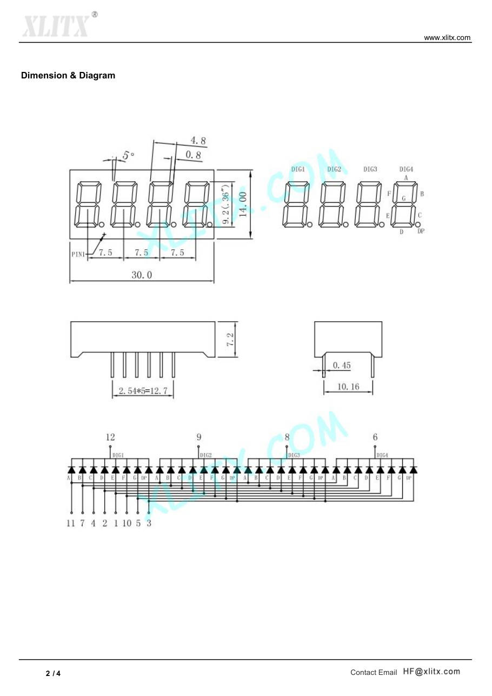

# 3641AS: 4-digit 7-segment display

**The 3641AS is the display part named in the kit schematic.** It is a
0.36-inch, red, 4-digit, common-cathode LED display with 12 pins. The kit
shows the frequency on it, such as `103.8`.

- **Source:** XLITX Technology, datasheet 3641AS, 4 pages:
  <https://www.xlitx.com/datasheet/3641AS.pdf>. Other makers sell parts
  with the same name and pinout.
- **Converted:** 2026-09-29, by hand, from the text and figures of the PDF.
- **Warning:** the kit schematic draws its own connection to this display
  (eight lines and seven 47 Ω resistors). This datasheet describes the
  standard 12-pin multiplex pinout. Do not assume that the board wires the
  part in the standard way.

Figure file: `/library/images/3641as-p02.jpg`.

## Key facts

| Item                       | Value                                                |
| -------------------------- | ---------------------------------------------------- |
| Digits                     | 4, with a decimal point on each                      |
| Common                     | Cathode, one common pin for each digit               |
| Digit height               | 0.36 inch (9.2 mm)                                   |
| Body                       | 30.0 × 14.0 mm, 7.2 mm high                          |
| Pin pitch                  | 2.54 mm, two rows of 6 pins                          |
| Peak wavelength            | 640 nm (red)                                         |
| Forward voltage            | 1.8 V typical at 10 mA                               |
| Reverse current            | 50 µA maximum at 5 V                                 |
| Continuous forward current | 30 mA for each segment                               |
| Peak forward current       | 200 mA for each segment (duty 1/10, 10 kHz)          |
| Reverse voltage            | 5 V                                                  |
| Power dissipation          | 100 mW for each segment                              |
| Operating temperature      | −20 to +75 °C                                        |
| Soldering                  | 230 °C for 5 seconds, 1.6 mm below the seating plane |

## Pinout (from the diagram)

| Pin | Function       | Pin | Function       |
| --- | -------------- | --- | -------------- |
| 1   | Segment E      | 7   | Segment B      |
| 2   | Segment D      | 8   | Digit 3 common |
| 3   | Segment DP     | 9   | Digit 2 common |
| 4   | Segment C      | 10  | Segment F      |
| 5   | Segment G      | 11  | Segment A      |
| 6   | Digit 4 common | 12  | Digit 1 common |

**Pin 1 sits at the lower left** with the digits facing you, as the
"PIN1" arrow of the drawing shows.

## Use

- **Multiplex:** connect the segments A to G and DP of all digits together.
  Turn on one digit common at a time, and refresh fast enough to hide the
  flicker.
- **Series resistor:** each segment needs one. At 3.3 V and 1.8 V forward,
  47 Ω gives about 32 mA, which is above the continuous rating of 30 mA.
  The average current in a multiplex is lower. Check the current of the
  kit with the HM310P before you change the drive.

## Open points

- **Wiring on the kit board.** The schematic has eight drive lines (D1 to
  D7 and S0) for a display that needs twelve pins. Trace the display pins
  to the microcontroller before path C writes a display driver.
