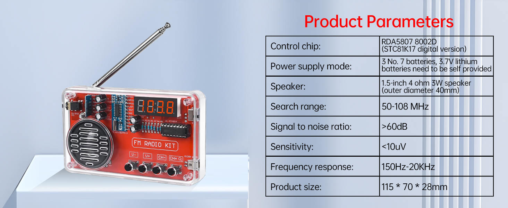
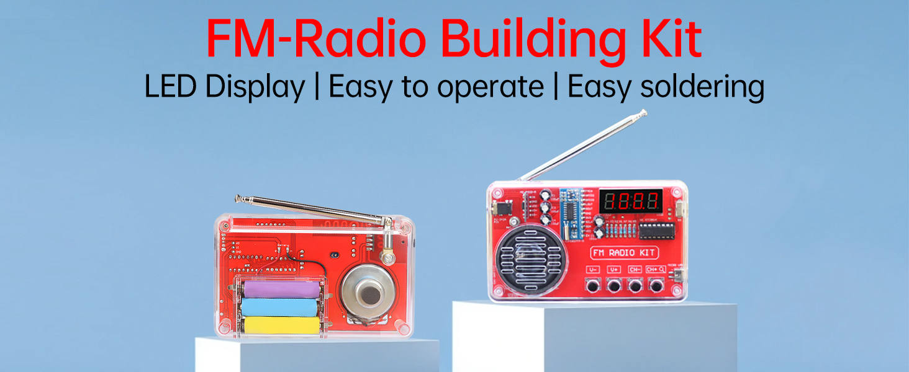
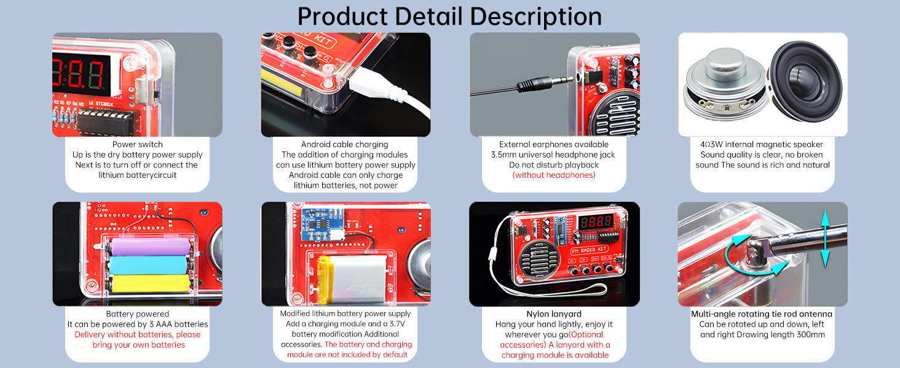

# FM radio kit: product page

**This file holds the facts of the seller's product page.** It has four
pictures: the parameter table, the kit as sold, the schematic, and the
detail views. The schematic has its own file (`fm-radio-kit-schematic.md`).

- **Source:** four pictures of the product page, saved by the person on
  2026-09-29. The page does not name the seller.
- **Converted:** 2026-09-29, by hand.

## Product parameters

Figure file: `/library/images/kit-product-parameters.jpg`.

| Parameter          | Value on the page                                                |
| ------------------ | ---------------------------------------------------------------- |
| Control chip       | RDA5807, 8002D (STC81K17 digital version). The chip is STC8G1K17 |
| Power supply mode  | 3 AAA batteries. A 3.7 V lithium battery must be provided        |
| Speaker            | 1.5-inch, 4 Ω, 3 W (outer diameter 40 mm)                        |
| Search range       | 50 to 108 MHz                                                    |
| Signal-to-noise    | More than 60 dB                                                  |
| Sensitivity        | Less than 10 µV                                                  |
| Frequency response | 150 Hz to 20 kHz                                                 |
| Product size       | 115 × 70 × 28 mm                                                 |

## The kit as sold

Figure file: `/library/images/kit-product-overview.jpg`. The picture shows the
clear case, the 4-digit red display, the buttons V−, V+, CH−, and CH+, the
speaker, and the back with the three AAA cells in a holder.

## Detail views

Figure file: `/library/images/kit-product-detail.jpg`.

| View            | What the page says                                                                      |
| --------------- | --------------------------------------------------------------------------------------- |
| Power switch    | Up is the dry battery supply. Down turns off or connects the lithium circuit            |
| Android cable   | With the charging module, a lithium battery charges. The cable does not power the radio |
| Headphone jack  | 3.5 mm. The jack does not disturb playback without headphones                           |
| Speaker         | 4 Ω, 3 W, internal, magnetic                                                            |
| Battery power   | 3 AAA batteries. The delivery has none                                                  |
| Lithium version | Add a charging module and a 3.7 V battery. Both are extra accessories                   |
| Lanyard         | A nylon lanyard is optional                                                             |
| Antenna         | Telescopic, turns up, down, left, and right. Length 300 mm                              |

## Open points

- **Micro-USB power.** The manual says the switch down connects micro-USB
  power. The page says the cable charges the lithium battery and does not
  power the radio. The schematic agrees with the page: USB reaches only the
  charging module socket.
- **Charging module.** The manual and the page do not name the charging
  chip. Its red and green charge LEDs match a TP4056 module (`tp4056.md`). This is a guess until someone reads the chip marking.
