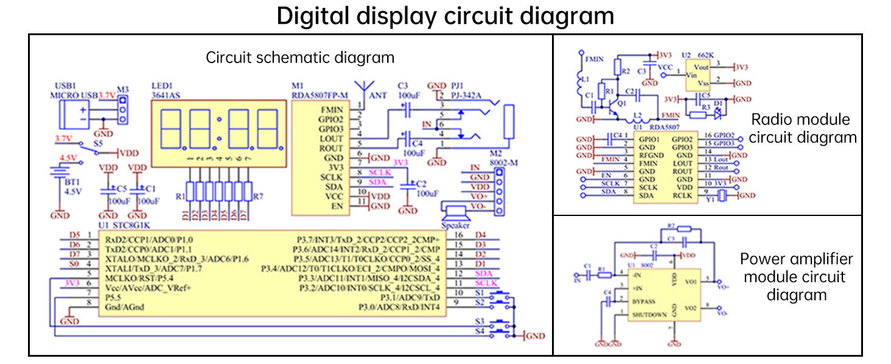

# FM radio kit: schematic

**This file transcribes the schematic of the kit.** The seller's product
page shows the schematic as one picture with three blocks: the main
circuit, the radio module, and the amplifier module. Read the picture
first, then use the tables below to find a net.

- **Source:** the "Digital display circuit diagram" picture of the product
  page. The picture is small. Every value below comes from a zoomed
  reading of the picture, and a value that the picture leaves open carries
  a **?**.
- **Confidence:** medium to high for the nets. The part values are
  unreadable in the picture. Check a net against the board before you rely
  on it.
- **Converted:** 2026-09-29. The conflicts of the first reading are
  resolved in the last section, from the circuit itself.

Figure file: `/library/images/kit-schematic.jpg`.

## The main circuit

| Ref      | Part                  | Role                                                           |
| -------- | --------------------- | -------------------------------------------------------------- |
| U1       | STC8G1K17, 16 pins    | Microcontroller: buttons, display, and the I²C master          |
| M1       | RDA5807FP-M           | Tuner module, 11 pins. Its inner circuit is the radio block    |
| M2       | 8002-M                | Amplifier module, 5 pins: IN, GND, VDD, VO+, VO−               |
| LED1     | 3641AS                | 4-digit 7-segment display, red, common cathode                 |
| R1 to R7 | 47 Ω (manual, step 1) | Series resistors between the drive lines and the display       |
| S1 to S4 | Tactile switches      | V−, V+, CH−, CH+ (the silkscreen order, left to right)         |
| S5       | Toggle switch         | Selects the charging module (3.7 V) or the battery BT1 (4.5 V) |
| C1, C5   | 100 µF electrolytic   | Bypass on VDD                                                  |
| C2       | 100 µF electrolytic   | Bypass on the net 3V3                                          |
| C3, C4   | 100 µF electrolytic   | Audio coupling from LOUT and ROUT to the jack                  |
| PJ1      | PJ-342A               | 3.5 mm headphone jack with switched contacts                   |
| USB1, M3 | Micro-USB, 3P header  | USB goes to the charging module only (see the supply)          |
| BT1      | 4.5 V battery (3 AAA) | Main supply                                                    |
| Speaker  | 4 Ω, 3 W              | On VO+ and VO− of M2                                           |

### The supply

The picture shows the following paths. Read them in this order.

1. **USB1 feeds only M3.** The + and − of the micro-USB port go to pins 2
   and 3 of the 3-pin header M3. Pin 1 of M3 is a net marked 3.7 V. M3 is
   the socket of the charging module (rechargeable version). USB never
   reaches the radio circuit directly.
2. **S5 chooses the source of VDD.** One pole is the 3.7 V net of M3, the
   output of the charging module and its lithium cell. The other pole is BT1
   at 4.5 V (three AAA cells). The common contact of S5 is the net **VDD**.
3. **VDD feeds** M1 pin 10 (VCC), M2 (VDD), and the capacitors C1 and C5.
4. **The regulator U2 (662K) makes 3V3 from VCC** inside the tuner module.
   Vin is VCC, and Vout is 3V3. M1 pin 7 is that 3V3 output. It feeds the
   tuner chip, the microcontroller (U1 pin 6), and the power LED D1 through
   the resistor R3 in the radio block. C2 (100 µF) decouples it.
5. **M1 pin 11 (EN) is tied to GND** in the picture. See the module pin
   table below.
6. **Grounds:** GND on every module and on U1 pin 8.

### The microcontroller U1 (STC8G1K17, 16 pins)

The pin names come from the STC8G1K17 pin table (`stc8g1k17.md`). The
labels on the right of each pin are the net names of the picture.

| U1 pin | Port | Net in the picture | What it does                                     |
| ------ | ---- | ------------------ | ------------------------------------------------ |
| 1      | P1.0 | D5                 | Display drive line                               |
| 2      | P1.1 | D6                 | Display drive line                               |
| 3      | P1.6 | D7                 | Display drive line                               |
| 4      | P1.7 | S0                 | Display drive line                               |
| 5      | P5.4 | S3 (CH−)           | Button. P5.4 is also the reset pin, when enabled |
| 6      | Vcc  | 3V3                | Supply                                           |
| 7      | P5.5 | S4 (CH+)           | Button                                           |
| 8      | GND  | GND                | Ground                                           |
| 9      | P3.0 | S2 (V+)            | Button, and the UART RxD for ISP                 |
| 10     | P3.1 | S1 (V−)            | Button, and the UART TxD for ISP                 |
| 11     | P3.2 | SCLK               | I²C clock to M1 pin 8 (I2CSCL_4)                 |
| 12     | P3.3 | SDA                | I²C data to M1 pin 9 (I2CSDA_4)                  |
| 13     | P3.4 | D1                 | Display drive line                               |
| 14     | P3.5 | D2                 | Display drive line                               |
| 15     | P3.6 | D3                 | Display drive line                               |
| 16     | P3.7 | D4                 | Display drive line                               |

- **Each button connects one pin to GND.** The picture draws the wires
  from pin 5 to S3, from pin 7 to S4, from pin 10 to S1, and from pin 9 to
  S2. With the silkscreen order, S1 is V−, S2 is V+, S3 is CH−, and S4 is
  CH+. Confirm this once with a multimeter on the board.
- **The display uses eight drive lines** (D1 to D7 and S0), and seven of
  them pass through the 47 Ω resistors R1 to R7. A plain 4-digit
  common-cathode display has 12 pins and needs 12 lines. Eight lines cannot
  drive it that way, so the display or its wiring differs from the standard
  part. The picture does not show how. **Trace the display pins** before
  path C writes a display driver.
- **The I²C pins carry no external pull-up resistor in the picture.** The
  STC8G1K17 pins have switchable internal 4 kΩ pull-ups.

### The tuner module M1 (RDA5807FP-M, 11 pins)

| M1 pin | Name  | Connects to                                  |
| ------ | ----- | -------------------------------------------- |
| 1      | FMIN  | The antenna ANT                              |
| 2      | GPIO2 | Not used                                     |
| 3      | GPIO3 | Not used                                     |
| 4      | LOUT  | C3 (100 µF), then jack PJ1                   |
| 5      | ROUT  | C4 (100 µF), then jack PJ1                   |
| 6      | GND   | GND                                          |
| 7      | 3V3   | The net 3V3 (the output of the regulator U2) |
| 8      | SCLK  | U1 pin 11 (P3.2)                             |
| 9      | SDA   | U1 pin 12 (P3.3)                             |
| 10     | VCC   | VDD (the input of the regulator U2)          |
| 11     | EN    | **GND**                                      |

**Do not drive M1 pin 11 as an enable.** The picture ties it to ground, and
the RDA5807FP has no enable pin: it powers up with the ENABLE bit of
register 0x02. In the radio block, the terminal named EN sits on chip pin 6,
a GND pin. So the module pin named EN is a ground pin.

### The jack PJ1 (PJ-342A)

- **Pins 3 and 4** take the left and right audio from C3 and C4.
- **Pins 5 and 6** are the switched contacts. Each closes to pin 3 or pin 4
  while no plug is in the jack. Pins 5 and 6 join at the net **IN**.
- **Result:** with no plug, the left and right signals meet at IN, with no
  mixing resistor, and IN feeds the amplifier. A plug opens both contacts,
  so the speaker goes silent and the sound goes to the headphones. The
  manual says the same (page 15).
- **Pins 1 and 2** are ground.

## The radio module block

The block shows the circuit inside M1: the tuner chip U1 (RDA5807, SOP16),
the crystal Y1, a discrete input stage (Q1 with the coils L1 and L2 and the
resistors R1 and R2), the regulator U2, and a power LED D1 with its resistor
R3 from 3V3 to GND.

| Ref (radio block) | Value or part        | Role                                              |
| ----------------- | -------------------- | ------------------------------------------------- |
| U1                | RDA5807              | The tuner chip. SOP16 pins as in the table below  |
| Y1                | Crystal              | The 32.768 kHz reference on RCLK (pin 9)          |
| U2                | 662K                 | 3.3 V regulator. Pin 1 Vin, pin 2 Vss, pin 3 Vout |
| Q1, L1, L2        | Transistor and coils | The FM input stage on FMIN                        |
| C1 to C5, R1, R2  | Small parts          | Bias, coupling, and bypass. Values are unreadable |
| D1, R3            | LED and resistor     | Power indicator from 3V3 to GND                   |

The pins of the tuner chip in the block:

| Pin | Name  | Note                         | Pin | Name  | Note                |
| --- | ----- | ---------------------------- | --- | ----- | ------------------- |
| 1   | GPIO1 | Bypass C4 to GND             | 16  | GPIO2 | To a module pin     |
| 2   | GND   |                              | 15  | GPIO3 | To a module pin     |
| 3   | RFGND |                              | 14  | GND   |                     |
| 4   | FMIN  | From the input stage         | 13  | Lout  | To the module LOUT  |
| 5   | GND   |                              | 12  | Rout  | To the module ROUT  |
| 6   | GND   | The module pin EN lands here | 11  | GND   |                     |
| 7   | SCLK  | From module pin 8            | 10  | VDD   | The net 3V3         |
| 8   | SDA   | From module pin 9            | 9   | RCLK  | With the crystal Y1 |

## The amplifier block (8002)

The picture shows the amplifier chip U1 (8002, 8 pins) in the standard
inverting bridge circuit.

- **Input:** IN goes through C1 and R1 to −IN (pin 4).
- **Feedback:** R2 in parallel with C3 runs from VO1 (pin 5) back to −IN.
  The first stage therefore inverts, with a gain of R2/R1.
- **Bias:** +IN (pin 3) is tied to BYPASS (pin 2). C4 from BYPASS to GND
  holds the mid-supply reference.
- **Supply:** VDD (pin 6) with C2 across VDD and GND. GND is pin 7.
- **Shutdown:** SHUTDOWN (pin 1) is tied to GND, so the amplifier is on.
- **Outputs:** VO1 (pin 5) is drawn as VO+, and VO2 (pin 8) as VO−.

| Pin | Name in the picture | Datasheet name (`hxj8002.md`) |
| --- | ------------------- | ----------------------------- |
| 1   | SHUTDOWN (to GND)   | SD                            |
| 2   | BYPASS              | BYP                           |
| 3   | +IN (to BYPASS)     | +IN                           |
| 4   | −IN                 | −IN                           |
| 5   | VO+                 | Vo1                           |
| 6   | VDD                 | VDD                           |
| 7   | GND                 | GND                           |
| 8   | VO−                 | Vo2                           |

## Conflicts of the first reading, resolved

These points looked like conflicts between the picture, the manual, and the
datasheets. Each one resolves from the circuit.

- **Left and right on the tuner pins: no conflict.** Both the datasheet top
  view and the kit picture put LOUT on pin 13 and ROUT on pin 12. Only the
  text of the datasheet pin table says "Right/Left" in reverse order.
- **Sign of the amplifier outputs: a naming difference.** The first stage
  has its feedback on −IN, so it inverts. VO1 (pin 5) is in antiphase with
  the input, and VO2 (pin 8) is in phase. The datasheet names the pins by
  that phase. The module silkscreen names them VO+ and VO− by position.
  One speaker plays the same with either sign. Keep the red and black wires
  of the manual (step 24).
- **The shutdown pin: no conflict.** A high level on SD shuts the amplifier
  down. GND keeps it on.
- **Micro-USB power: the product page is right.** The picture connects USB
  only to the charging module socket M3. S5 selects the module output or
  the battery. Without a charging module, the USB port powers nothing. The
  manual line that the switch down "connects the micro-USB power supply"
  means the charging-module path.
- **The 3 V line of the manual: it does not limit VDD.** Every chip that has
  a 3.3 V rating runs from the regulated net 3V3: the tuner chip and the
  microcontroller. VDD feeds the regulator input and the 8002, which allow
  up to 6.0 V. So VDD can be 3.7 V to 4.8 V (a full 3 AAA set can reach
  about 4.8 V). The net 3V3 must never exceed 3.3 V. **The circuit has no
  reverse-polarity protection.** Confirm with a reading of VDD and 3V3 at
  the first power-on.
- **Regulator headroom:** the regulator needs about 0.2 to 0.3 V above
  3.3 V (low confidence, see `xc6206-662k.md`). A lithium cell below about
  3.6 V drops 3V3 below 3.3 V. The chips still work down to 2.7 V (tuner).

## Open points

- **The display wiring.** Eight lines cannot drive a standard 12-pin display.
- **The values of the small parts.** The picture does not show them.
- **The part behind S5's 3.7 V pole.** Without a charging module, that
  pole is unconnected.
