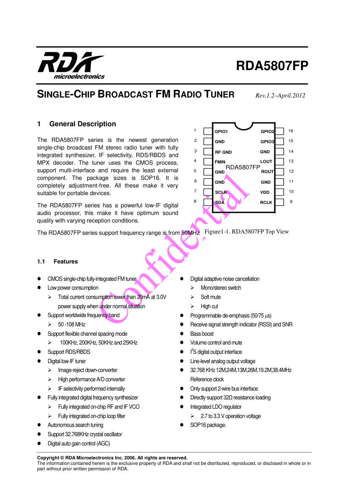
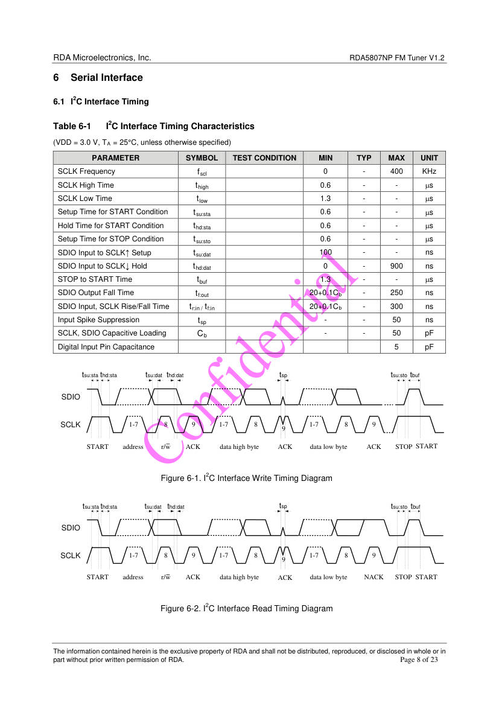
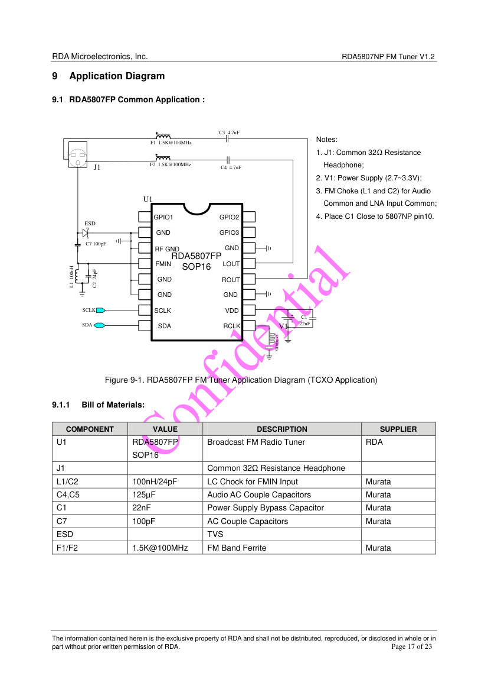
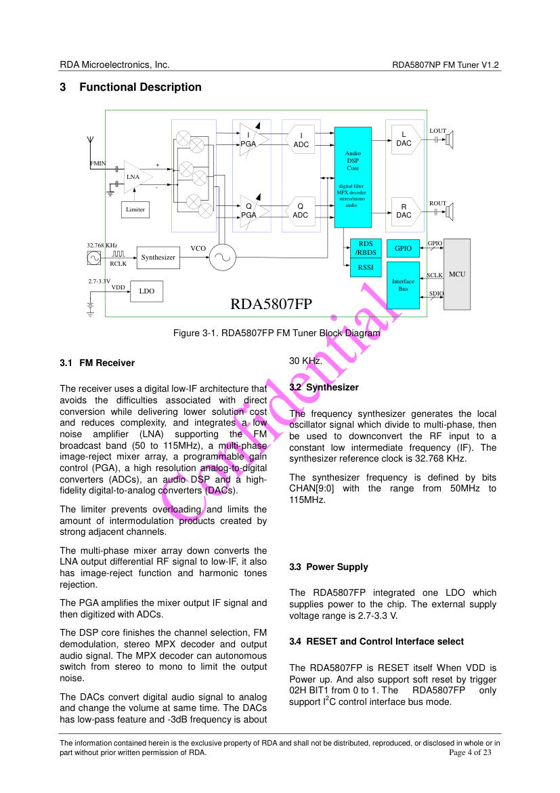

# RDA5807FP: single-chip broadcast FM radio tuner

**The RDA5807FP is the tuner chip of the kit.** It receives FM, decodes
stereo and RDS, and gives line-level audio on LOUT and ROUT. A
microcontroller controls it over I²C. The kit sells it on a module named
RDA5807FP-M.

- **Source:** RDA Microelectronics, "RDA5807FP Single-chip broadcast FM
  radio tuner", Rev. 1.2, April 2012, 23 pages. Mirror used:
  <https://opendevices.ru/wp-content/uploads/2015/10/RDA5807FP.pdf>.
- **Converted:** 2026-09-29, by hand, from the text and figures of the PDF.
  The wording is shorter. The numbers are the datasheet's numbers.
- **Rights:** the datasheet carries this notice: "The information contained
  herein is the exclusive property of RDA and shall not be distributed,
  reproduced, or disclosed in whole or in part without prior written
  permission of RDA." This file is a working summary for the bench. Read
  the original before you rely on a value for a design.
- **Note:** the page headers of the PDF say "RDA5807NP FM Tuner V1.2".
  The document mixes the two names. Treat both as this chip.

Figure file: `/library/images/rda5807fp-p01.jpg`.

## Key facts

| Item               | Value                                                         | Page |
| ------------------ | ------------------------------------------------------------- | ---- |
| Package            | SOP16                                                         | 1    |
| Supply (VDD)       | 2.7 to 3.3 V, typical 3.0 V                                   | 6    |
| Supply current     | 20 mA (strong signal), 21 mA (weak signal), at 3.0 V, enabled | 6    |
| Power-down current | 25 µA (ENABLE = 0)                                            | 6    |
| Frequency range    | 50 to 115 MHz, set by the band bits                           | 1, 7 |
| Band default       | 87 to 108 MHz (BAND = 00)                                     | 10   |
| Channel spacing    | 100, 200, 50, or 25 kHz                                       | 1    |
| Reference clock    | 32.768 kHz crystal, or an external clock (RCLK)               | 1    |
| Control bus        | I²C only, up to 400 kHz                                       | 5, 8 |
| I²C address        | `0010000b` (0x10) 7-bit                                       | 5    |
| Audio output       | Line level, 360 mV typical at volume 15. Load 32 Ω or more    | 7    |
| Sensitivity        | 1.2 to 1.5 µV EMF at S/N 26 dB (65 to 108 MHz)                | 7    |
| Signal-to-noise    | 57 dB mono, 55 dB stereo typical (55 and 53 dB minimum)       | 7    |
| Stereo separation  | 35 dB minimum                                                 | 7    |
| Absolute maximum   | Input voltage −0.3 V to VDD + 0.3 V. Ambient −40 to +90 °C    | 6    |
| Operating ambient  | −20 to +75 °C                                                 | 6    |
| Extras             | RSSI, SNR, soft mute, high cut, bass boost, RDS/RBDS, I²S out | 1    |

**The supply is 3.3 V at most.** The input maximum of SCLK and SDA is
VDD + 0.3 V, so a 5 V level on the bus is outside the ratings. A
Raspberry Pi Pico drives 3.3 V, so it matches.

## Pins (SOP16)

| Pin             | Name        | Function                                                                               |
| --------------- | ----------- | -------------------------------------------------------------------------------------- |
| 1, 16, 15       | GPIO1, 2, 3 | General purpose. GPIO2 is the seek/tune interrupt (low). GPIO3 is the stereo indicator |
| 2, 5, 6, 11, 14 | GND         | Ground                                                                                 |
| 3               | RF GND      | RF ground                                                                              |
| 4               | FMIN        | FM antenna input                                                                       |
| 7               | SCLK        | I²C clock                                                                              |
| 8               | SDA (SDIO)  | I²C data                                                                               |
| 9               | RCLK        | 32.768 kHz reference clock                                                             |
| 10              | VDD         | Supply, 2.7 to 3.3 V. Bypass with 22 nF close to the pin                               |
| 13              | LOUT        | Left audio output                                                                      |
| 12              | ROUT        | Right audio output                                                                     |

**Pin 13 is LOUT and pin 12 is ROUT.** The top view on page 1 shows this, and
the kit schematic agrees. The pin table on page 15 lists "13, 12" in the same
order, but its text calls the two outputs "Right/Left", which is the reverse.
The top view and the schematic decide.

## The I²C interface (pages 5 and 8)

- **Address:** the 7-bit address is `0010000b` (0x10). The address byte is
  0x20 for a write and 0x21 for a read.
- **No register address on the wire.** A write starts at register 0x02 and
  goes on to 0x03, 0x04, and so on. A read starts at register 0x0A and goes
  on to 0x0B, and so on. Each register is 16 bits, high byte first.
- **End of a transfer:** the master sends STOP after a write. After a read,
  the master sends NACK on the last byte, then STOP.
- **This datasheet describes sequential access only.** It does not describe
  a second address for random access.
- **Wrap:** after register 0x3A the counter wraps to 0x00.
- **Timing (VDD 3.0 V):**

| Parameter                     | Min    | Max     |
| ----------------------------- | ------ | ------- |
| SCLK frequency                | 0      | 400 kHz |
| SCLK high time                | 0.6 µs |         |
| SCLK low time                 | 1.3 µs |         |
| START setup and hold          | 0.6 µs |         |
| STOP setup                    | 0.6 µs |         |
| Bus free time (STOP to START) | 1.3 µs |         |
| Data setup                    | 100 ns |         |
| Bus load (SCLK, SDIO)         |        | 50 pF   |

Figure file: `/library/images/rda5807fp-p08.jpg`.

## Registers (pages 9 to 14)

Registers 0x02 to 0x07 are for writing. Registers 0x0A to 0x0F are for
reading. Register 0x00 holds the chip ID (0x58 in the high byte).

### 0x02: control

| Bits | Name               | Meaning                                                                                                  | Default |
| ---- | ------------------ | -------------------------------------------------------------------------------------------------------- | ------- |
| 15   | DHIZ               | 0 = audio output high impedance. 1 = normal                                                              | 0       |
| 14   | DMUTE              | 0 = mute. 1 = normal                                                                                     | 0       |
| 13   | MONO               | 0 = stereo. 1 = force mono                                                                               | 0       |
| 12   | BASS               | 1 = bass boost                                                                                           | 0       |
| 11   | RCLK non-calibrate | 1 = RCLK is not always supplied while FM works                                                           | 0       |
| 10   | RCLK direct input  | 1 = use the direct input mode                                                                            | 0       |
| 9    | SEEKUP             | 0 = seek down. 1 = seek up                                                                               | 0       |
| 8    | SEEK               | 1 = start a seek. The chip clears it and sets STC                                                        | 0       |
| 7    | SKMODE             | 0 = wrap at the band limit. 1 = stop at the limit                                                        | 0       |
| 6:4  | CLK_MODE           | 000 = 32.768 kHz, 001 = 12 MHz, 101 = 24 MHz, 010 = 13 MHz, 110 = 26 MHz, 011 = 19.2 MHz, 111 = 38.4 MHz | 000     |
| 3    | RDS_EN             | 1 = RDS/RBDS on                                                                                          | 0       |
| 2    | NEW_METHOD         | 1 = new demodulation, about 1 dB more sensitivity                                                        | 0       |
| 1    | SOFT_RESET         | Set 1 to reset. Also resets on power-up                                                                  | 0       |
| 0    | ENABLE             | 1 = power up                                                                                             | 0       |

### 0x03: channel

| Bits | Name        | Meaning                                                                                                        | Default |
| ---- | ----------- | -------------------------------------------------------------------------------------------------------------- | ------- |
| 15:6 | CHAN[9:0]   | Channel number                                                                                                 | 0       |
| 5    | DIRECT MODE | Test only                                                                                                      | 0       |
| 4    | TUNE        | Set 1 to tune. The chip clears it when STC becomes 1                                                           | 0       |
| 3:2  | BAND[1:0]   | 00 = 87 to 108 MHz. 01 = 76 to 91 MHz. 10 = 76 to 108 MHz. 11 = 65 to 76 MHz, or 50 to 76 MHz (see 0x07 bit 9) | 00      |
| 1:0  | SPACE[1:0]  | 00 = 100 kHz. 01 = 200 kHz. 10 = 50 kHz. 11 = 25 kHz                                                           | 00      |

**The frequency of a channel:** `f = spacing × CHAN + base`, where the base
is 87.0 MHz for BAND 00, 76.0 MHz for BAND 01 and 10, and 65.0 MHz for
BAND 11. The datasheet gives no other base for the 50 to 76 MHz mode of
BAND 11, so a channel there needs a check on the bench.

### 0x04, 0x05, 0x06, 0x07

| Reg  | Bits  | Name         | Meaning                                                                          |
| ---- | ----- | ------------ | -------------------------------------------------------------------------------- |
| 0x04 | 14    | STCIEN       | 1 = GPIO2 pulses low when a seek or tune ends                                    |
| 0x04 | 11    | DE           | De-emphasis. 0 = 75 µs. 1 = 50 µs (default 0)                                    |
| 0x04 | 9     | SOFTMUTE_EN  | 1 = soft mute on (default 1)                                                     |
| 0x04 | 8     | AFCD         | 1 = AFC off (default 0)                                                          |
| 0x04 | 6     | I2S_ENABLED  | 1 = I²S output on                                                                |
| 0x04 | 5:4   | GPIO3        | 00 = high-Z, 01 = stereo indicator, 10 = low, 11 = high                          |
| 0x04 | 3:2   | GPIO2        | 00 = high-Z, 01 = interrupt, 10 = low, 11 = high                                 |
| 0x04 | 1:0   | GPIO1        | 00 = high-Z, 01 = reserved, 10 = low, 11 = high                                  |
| 0x05 | 15    | INT_MODE     | 0 = 5 ms interrupt. 1 = interrupt lasts until a read of 0x0C                     |
| 0x05 | 11:8  | SEEKTH       | Seek SNR threshold. Default 1000, about 32 dB SNR                                |
| 0x05 | 7:6   | LNA_PORT_SEL | 10 = FMIN                                                                        |
| 0x05 | 3:0   | VOLUME       | 0000 = mute (output impedance very large), 1111 = maximum (default). Logarithmic |
| 0x06 | 14:13 | OPEN_MODE    | 11 = allow writes to the registers after 0x06                                    |
| 0x07 | 14:10 | TH_SOFRBLEND | Noise soft-blend threshold, 2 dB steps (default 10000)                           |
| 0x07 | 9     | 65M_50M MODE | With BAND 11: 1 = 65 to 76 MHz, 0 = 50 to 76 MHz (default 1)                     |
| 0x07 | 1     | SOFTBLEND_EN | 1 = soft blend on (default 1)                                                    |
| 0x07 | 0     | FREQ_MODE    | 1 = frequency = 76000 (or 87000) kHz + the value of 0x08                         |

### 0x0A and 0x0B: status (read)

| Reg          | Bits     | Name         | Meaning                                                                                         |
| ------------ | -------- | ------------ | ----------------------------------------------------------------------------------------------- |
| 0x0A         | 15       | RDSR         | 1 = a new RDS group is ready                                                                    |
| 0x0A         | 14       | STC          | 1 = the seek or tune completed                                                                  |
| 0x0A         | 13       | SF           | 1 = the seek failed                                                                             |
| 0x0A         | 12       | RDSS         | 1 = the RDS decoder is synchronized                                                             |
| 0x0A         | 10       | ST           | 1 = stereo                                                                                      |
| 0x0A         | 9:0      | READCHAN     | The channel now tuned. Same formula as CHAN                                                     |
| 0x0B         | 15:9     | RSSI         | Signal strength, 7 bits, logarithmic. The table text says 000000 = minimum and 111111 = maximum |
| 0x0B         | 8        | FM TRUE      | 1 = the channel is a station                                                                    |
| 0x0B         | 7        | FM_READY     | 1 = ready                                                                                       |
| 0x0B         | 3:2, 1:0 | BLERA, BLERB | RDS block error levels                                                                          |
| 0x0C to 0x0F | 15:0     | RDSA to RDSD | RDS blocks A to D                                                                               |

**For a scan,** read RSSI (0x0B bits 15:9) and FM TRUE (bit 8) after each
tune, and wait for STC (0x0A bit 14). RSSI has 7 bits, but the table gives
the range as six bits. Measure the real range on the bench.

## A worked tune (derived, not in the datasheet)

**The example below comes from the register tables above.** It has not run on
this hardware. Check it on the bench before you use it.

Goal: tune 100.1 MHz in the default band (BAND 00, spacing 100 kHz).

1. `CHAN = (100.1 − 87.0) / 0.1 = 131 = 0x083`.
2. Power up: write register 0x02 = `0xC001` (DHIZ = 1, DMUTE = 1,
   ENABLE = 1).
3. Tune: write register 0x03 = `(131 << 6) | 0x10` = `0x20D0` (CHAN = 131,
   TUNE = 1, BAND 00, spacing 100 kHz).
4. Read register 0x0A until bit 14 (STC) is 1. Then read READCHAN
   (bits 9:0) and expect 131.
5. Read register 0x0B for RSSI and FM TRUE.

On the wire, one write of registers 0x02 and 0x03 is the address byte
`0x20`, then `C0 01 20 D0`.

## Application circuit (page 17)

Figure file: `/library/images/rda5807fp-p17.jpg`. The datasheet circuit uses
a 32.768 kHz crystal on RCLK, a 100 nH inductor and a 24 pF capacitor as the
FM input choke, two ferrite beads (1.5 kΩ at 100 MHz) on the audio path, two
audio coupling capacitors, and a 22 nF bypass capacitor on VDD close to pin 10.

## Block diagram

Figure file: `/library/images/rda5807fp-p04.jpg`.

## Open points for the kit

- **Which band the kit firmware sets.** The product page says 50 to 108 MHz.
  The chip defaults to 87 to 108 MHz. Read register 0x03 with a script to
  see the band of the stock firmware.
- **RDS.** The chip supports RDS. The kit shows no RDS output. Whether the
  firmware enables it is not known.
- **Pull-up resistors on SCLK and SDA.** The kit picture shows no external
  pull-up. The internal pin figure (page 16) shows a 47 kΩ element on
  SCLK and SDIO, and the text does not call it a pull-up. Whether the bus
  works without an external pull-up is not known.
