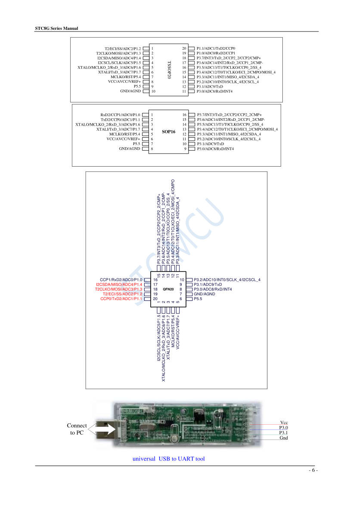
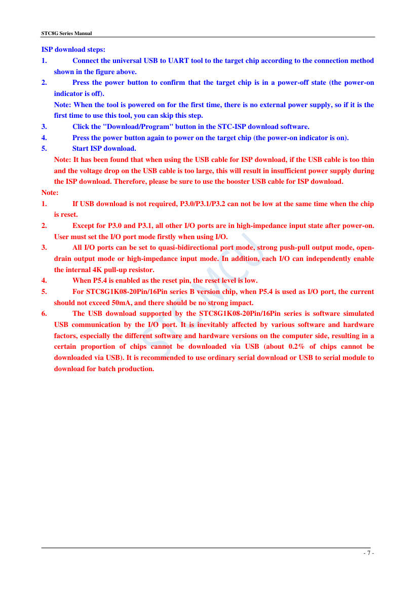

# STC8G1K17: 8051 microcontroller (16 pins in the kit)

**The STC8G1K17 is the microcontroller of the kit.** It reads the four
buttons, drives the display, and controls the tuner over I²C. The kit
schematic names it STC8G1K, and the board photo shows `STC8G1K17` on the
chip in a 16-pin DIP socket.

- **Source:** STC Micro, "STC8G Series Manual" (English, 867 pages):
  <https://www.stcmicro.com/datasheet/STC8G-en.pdf>. This file uses
  section 2.1 (features, pinouts, ISP wiring, pages 3 to 7 of the manual),
  section 3 (pin switching), and appendix O (electrical characteristics).
- **Converted:** 2026-09-29, by hand, from the text and figures of the PDF.
  The manual has more than 800 pages. Read the original for the registers
  of a peripheral.
- **Other family names:** the manual covers the STC8G1K08 family, and the
  STC8G1K17 is one member.

## Key facts (section 2.1, pages 3 to 5)

| Item        | Value                                                                                              |
| ----------- | -------------------------------------------------------------------------------------------------- |
| Core        | 1T 8051, about 12 times faster than the classic 8051                                               |
| Supply      | 1.9 to 5.5 V, with a built-in regulator                                                            |
| Temperature | −40 to +85 °C                                                                                      |
| Flash       | 17 KB, 100 000 erase cycles                                                                        |
| RAM         | 128 B DATA, 128 B IDATA, 1 KB XDATA                                                                |
| EEPROM      | Configurable size, 512 B pages (the family table lists it as IAP)                                  |
| Clock       | Internal RC, 4 to 36 MHz, ±0.3 % at 25 °C. No crystal needed                                       |
| I/O         | Up to 18: P1.0 to P1.7, P3.0 to P3.7, P5.4, P5.5                                                   |
| Peripherals | 3 timers, 2 UARTs, SPI, I²C (master or slave), 3 PCA/CCP/PWM, 10-bit ADC (15 channels), comparator |
| Interrupts  | 16 sources, 4 priority levels                                                                      |
| Packages    | TSSOP20, QFN20, SOP20, DIP20, SOP16, DIP16 (DIP and SOP20 are "not recommended" for new designs)   |
| Reset       | Power-on reset 1.69 to 1.82 V. P5.4 can be a reset pin (active low) set at ISP time                |

**Pins are high-Z after reset, except P3.0 and P3.1.** The firmware must
set the mode of each pin before use. The modes are quasi-bidirectional,
push-pull, open drain, and high-impedance input. Each pin can enable an
internal 4 kΩ pull-up.

## Pins (SOP16 and DIP16, pages 6 to 7)

Figure file: `/library/images/stc8g1k17-p20.jpg`.

| Pin | Port | Other functions                        | In the kit (see `fm-radio-kit-schematic.md`) |
| --- | ---- | -------------------------------------- | -------------------------------------------- |
| 1   | P1.0 | ADC0, RxD2, CCP1                       | Display line D5                              |
| 2   | P1.1 | ADC1, TxD2, CCP0                       | Display line D6                              |
| 3   | P1.6 | ADC6, XTALO, MCLKO_2, RxD_3            | Display line D7                              |
| 4   | P1.7 | ADC7, XTALI, TxD_3                     | Display line S0                              |
| 5   | P5.4 | MCLKO, RST                             | Unlabeled                                    |
| 6   | Vcc  | AVcc, ADC VRef+                        | Supply, the net 3V3                          |
| 7   | P5.5 |                                        | A button line (unconfirmed)                  |
| 8   | GND  | AGND                                   | Ground                                       |
| 9   | P3.0 | ADC8, RxD, INT4                        | A button line (unconfirmed). UART for ISP    |
| 10  | P3.1 | ADC9, TxD                              | A button line (unconfirmed). UART for ISP    |
| 11  | P3.2 | ADC10, INT0, SCLK_4, **I2CSCL_4**      | I²C clock to the tuner                       |
| 12  | P3.3 | ADC11, INT1, MISO_4, **I2CSDA_4**      | I²C data to the tuner                        |
| 13  | P3.4 | ADC12, T0, T1CLKO, ECI_2, CMPO, MOSI_4 | Display line D1                              |
| 14  | P3.5 | ADC13, T1, T0CLKO, CCP0_2, SS_4        | Display line D2                              |
| 15  | P3.6 | ADC14, INT2, RxD_2, CCP1_2, CMP−       | Display line D3                              |
| 16  | P3.7 | INT3, TxD_2, CCP2, CCP2_2, CMP+        | Display line D4                              |

**The ADC reference pin must not float.** Connect VRef+ to a reference or to
Vcc. In the 16-pin package it shares pin 6 with Vcc.

## I²C (section 3, pages 49 and 50)

- **Modes:** master or slave.
- **Pin selection:** bits I2C_S[1:0] of the register P_SW2 (address 0xBA)
  choose the pins. The value `11` selects SCL on P3.2 and SDA on P3.3. That
  is the pair that the kit uses. The other values give P1.5/P1.4 (`00`) and
  P2.5/P2.4 (`01`) on larger packages.
- **Extended registers:** P_SW2 bit 7 (EAXFR) must be 1 to reach the
  extended register area (XFR). Check in the I²C chapter of the manual
  whether the I²C registers of this family sit in that area.

## ISP: how the chip is programmed (section 2.1, page 7)

- **Wiring:** a USB-to-UART tool connects to GND, Vcc, and the UART pins
  **P3.0 (RxD)** and **P3.1 (TxD)**.
- **Steps:** connect the tool, confirm that the target is powered off,
  click "Download/Program" in the STC-ISP software, then power the target
  on. The download starts at power-on.
- **Supply:** a thin USB cable drops too much voltage. The manual asks for
  a good cable.
- **Reset condition:** if USB download is not needed, P3.0, P3.1, and P3.2
  must not all be low at reset.
- **USB download of this family is software-simulated on the pins.** About
  0.2 % of chips cannot download through USB. Use a serial tool for
  repeated work.
- **Reading back:** the manual excerpt does not say that the stock firmware
  can be read back. Keep a spare chip with the stock firmware before path C
  overwrites the kit chip.

Figure file: `/library/images/stc8g1k17-p21.jpg`.

## Electrical limits (appendix O, page 831)

| Parameter             | Min    | Max         |
| --------------------- | ------ | ----------- |
| Storage temperature   | −55 °C | +125 °C     |
| Operating temperature | −40 °C | +85 °C      |
| Operating voltage     | 1.9 V  | 5.5 V       |
| VDD to ground         | −0.3 V | +5.5 V      |
| I/O pin to ground     | −0.3 V | VDD + 0.3 V |

| At VDD = 3.3 V, 25 °C        | Typical |
| ---------------------------- | ------- |
| Power-down current           | 0.4 µA  |
| Idle current, 12 MHz         | 1.00 mA |
| Idle current, 24 MHz         | 1.16 mA |
| Comparator                   | 90 µA   |
| Low-voltage detection module | 10 µA   |

The kit runs the chip at 3.3 V (net 3V3), so an I²C master on the same bus
must use 3.3 V levels.

## Open points

- **Which package of the family.** The photo shows a DIP16 chip. The manual
  lists DIP16 as "not recommended". A spare must match the DIP16 package.
- **The stock firmware.** Nobody has dumped it. Its display drive and
  button map come from tracing the board.
- **Which pins the four buttons use.** See the schematic file.
