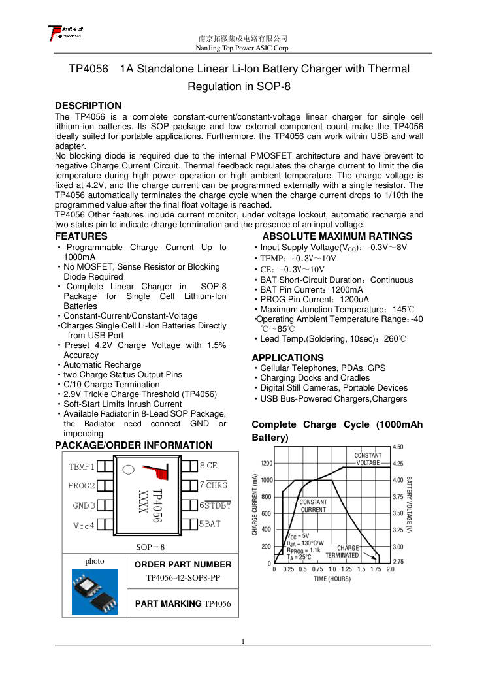

# TP4056: 1 A lithium-ion battery charger (probable charging module)

**The TP4056 is the likely chip of the charging module of the rechargeable
kit.** The kit documents do not name the chip. The description matches a
TP4056 module: a micro-USB input, a red LED while charging, and a green
LED when the battery is full. Confirm the marking on the module before you
rely on this file.

- **Source:** NanJing Top Power ASIC, "TP4056 1A Standalone Linear Li-Ion
  Battery Charger with Thermal Regulation in SOP-8":
  <https://dlnmh9ip6v2uc.cloudfront.net/datasheets/Prototyping/TP4056.pdf>
  (a mirror of the datasheet).
- **Converted:** 2026-09-29, by hand, from the text of the PDF (3 pages).
  The typical application circuit and the charge-current graphs are in the
  PDF.

Figure file: `/library/images/tp4056-p01.jpg`.

## Key facts

| Item                      | Value                                                              |
| ------------------------- | ------------------------------------------------------------------ |
| Type                      | Constant-current, constant-voltage linear charger, one Li-ion cell |
| Input voltage             | 4.0 to 8.0 V (typical 5 V). Absolute maximum 8 V                   |
| Charge voltage            | 4.2 V, ±1.5 % (4.137 to 4.263 V at 0 to 85 °C)                     |
| Charge current            | Set by a resistor on PROG, up to 1000 mA                           |
| Current at RPROG = 1.2 kΩ | 1000 mA (950 to 1050 mA)                                           |
| Current at RPROG = 2.4 kΩ | 500 mA (450 to 550 mA)                                             |
| Trickle charge            | 130 mA at 1.2 kΩ, below 2.9 V (2.8 to 3.0 V)                       |
| End of charge             | When the current falls to 1/10 of the set value (C/10)             |
| Input supply current      | 150 µA typical while charging, 55 µA in standby                    |
| Thermal regulation        | At 145 °C junction the chip reduces the charge current             |
| Operating ambient         | −40 to +85 °C                                                      |

## Pins (SOP-8)

| Pin | Name  | Function                                                    |
| --- | ----- | ----------------------------------------------------------- |
| 1   | TEMP  | Battery thermistor input. Ground it to turn the sensing off |
| 2   | PROG  | Charge current resistor to GND                              |
| 3   | GND   | Ground                                                      |
| 4   | VCC   | Supply                                                      |
| 5   | BAT   | Battery. It holds 4.2 V at the end of charge                |
| 6   | STDBY | Open drain, low when the charge ends                        |
| 7   | CHRG  | Open drain, low while charging                              |
| 8   | CE    | Chip enable. High = on                                      |

## The two LEDs

| State                                              | Red LED | Green LED |
| -------------------------------------------------- | ------- | --------- |
| Charging                                           | On      | Off       |
| Charge finished                                    | Off     | On        |
| Input too low, battery too hot or cold, no battery | Off     | Off       |

## Module notes (secondary source: Utmel)

- **The module may have no reverse-polarity protection** on the battery
  pads (one secondary source says so). The kit manual asks for the right polarity when the battery connects
  (`fm-radio-kit-manual.md`, rechargeable version).
- **A 3.7 V cell reaches 4.2 V when full.** The radio must tolerate that on
  VDD. The 8002 amplifier maximum is 6.0 V (`hxj8002.md`), and the
  regulator input limit is not confirmed (`xc6206-662k.md`).
- **The module in the kit only charges.** The product page says the cable
  does not power the radio.
