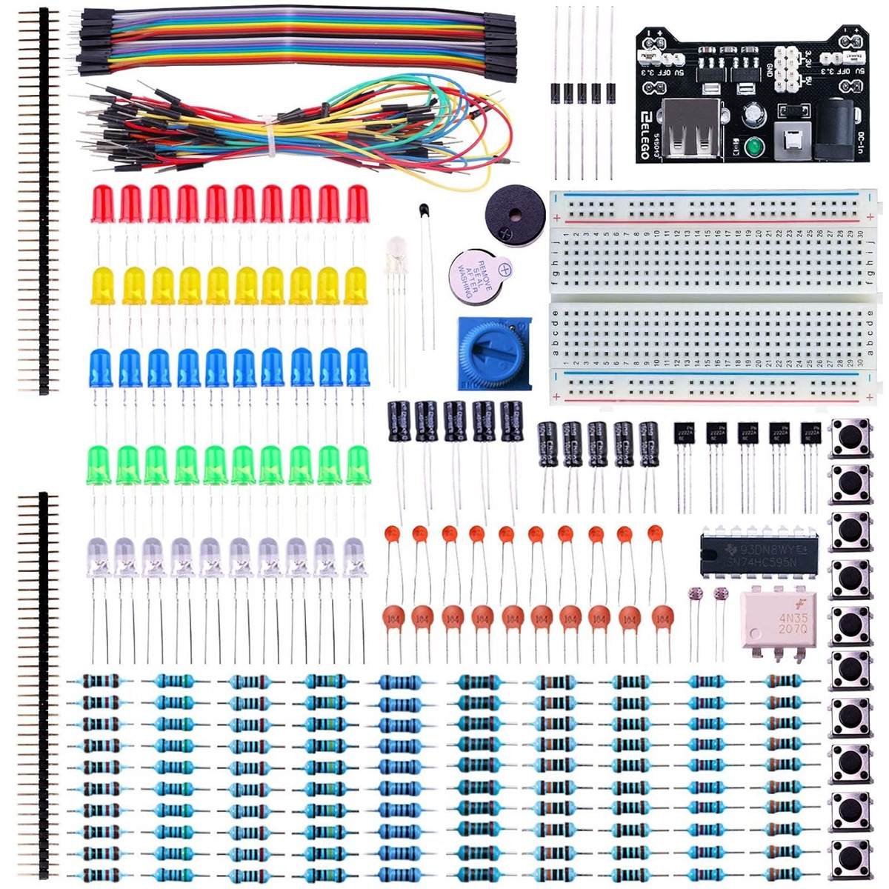

# The FM radio kit

**The kit is a digital FM receiver in a clear case.** A tuner module does
the radio, and a small microcontroller reads the buttons and drives the
display. [`next.md`](next.md) holds the milestone that builds on it.

## What the photo shows

**The parts below come from the product photo.** Each one needs a check
against the kit when it arrives. Activity 2 of [`next.md`](next.md) settles
them.

| Part                                              | Marking in the photo | Role                                                                         |
| ------------------------------------------------- | -------------------- | ---------------------------------------------------------------------------- |
| FM tuner module                                   | RDA5807FP-M          | The receiver: tuning, demodulation, and signal strength, controlled over I²C |
| Microcontroller, 16 pins                          | STC8G1K, in a socket | Reads the four buttons, drives the tuner and the display                     |
| Amplifier module                                  | 8002                 | Audio to the speaker                                                         |
| Power module                                      | CAI-222              | Power from the micro-USB port, probably a battery charger                    |
| 4-digit 7-segment display                         |                      | The frequency, such as 103.8                                                 |
| Buttons                                           | V−, V+, CH−, CH+     | Volume, and the previous or next station                                     |
| Speaker, headphone jack, telescopic antenna, case |                      |                                                                              |

**The board brings the bus of the tuner to its silkscreen.** The photo
shows FMIN, GPIO2, GPIO3, LOUT, ROUT, GND, 3V3, SCLK, and SDA beside the
tuner module. Paths B and C use SCLK and SDA. LOUT and ROUT give the audio
to a USB audio input.

## The three paths to agent control

| Path | How                                                                                            | The team gets                                                     | Effort |
| ---- | ---------------------------------------------------------------------------------------------- | ----------------------------------------------------------------- | ------ |
| A    | A Pico presses the buttons through transistors or an optocoupler. The camera reads the display | Station steps and volume. No signal strength                      | Low    |
| B    | The Pico takes the I²C bus, with the STC8G1K out of its socket                                 | Any frequency, seek, volume, and the signal strength of the tuner | Medium |
| C    | New firmware for the STC8G1K adds a serial command interface                                   | All of B, with the buttons and the display still working          | High   |

**Path A changes nothing on the board.** The Pico closes each button
through a PN2222 or the 4N35 of the ELEGOO kit. The team knows the
frequency only from the display, so the camera and its digit reading
carry path A.

**Path B makes the Pico the only master of the bus.** The STC8G1K comes out
of its socket, and the Pico drives the RDA5807 directly. Both run at 3.3 V.
The display and the buttons go dark. The STC8G1K goes back in its socket to
restore the stock radio.

**Path C keeps the radio whole.** The stock firmware cannot be read back
from the STC8G1K, so a spare chip holds it. The new firmware runs on the
chip from the kit, or on a second spare.

## On hand

**The person has two FM radio kits, the ELEGOO Electronics Fun Kit, and
soldering equipment.** The first FM kit is built by hand, and carries paths
A and B. The second kit is built with the guidance of the team.

**The ELEGOO kit gives the breadboard work around the radio:** the wiring
of the Pico, the button presses of path A, and the pull-up resistors of the
bus.

| Item                                                     | For the radio                                                                                       |
| -------------------------------------------------------- | --------------------------------------------------------------------------------------------------- |
| Two FM radio kits                                        | The first for paths A and B, built by hand. The second for the guided build                         |
| Soldering iron, solder, flux, desoldering wick           | The assembly of both kits (activities 2 and 7 of [`next.md`](next.md))                              |
| ELEGOO kit: breadboard, jumper and Dupont wires, headers | The connections of the Pico to the radio                                                            |
| ELEGOO kit: PN2222 transistors, 4N35 optocoupler         | Path A: the Pico closes each button of the radio                                                    |
| ELEGOO kit: resistors (1 kΩ, 5.1 kΩ, 10 kΩ)              | Base resistors of the transistors, and pull-ups of SCLK and SDA when the board has none             |
| ELEGOO kit: breadboard power module                      | 5 V and 3.3 V on the breadboard, from a 9 V adapter                                                 |
| HANMATEK HM310P                                          | The first power-on of the radio, current-limited                                                    |
| Logitech BRIO camera                                     | The view of the bench, and the digits of the display in path A                                      |
| USB microphone                                           | The sound of the radio and the bench, independent of the camera                                     |
| Lambda Vector workstation: two RTX 4090, 128 GB RAM      | The workstation of the workspace, and the perception of images and sound (see [`next.md`](next.md)) |

## To get

| Item                                             | For                         | Status                  |
| ------------------------------------------------ | --------------------------- | ----------------------- |
| Raspberry Pi Pico, with pin headers              | Paths A and B               | Buy                     |
| Micro-USB data cable, for the Pico               | Paths A and B               | Buy                     |
| USB-to-serial adapter, 3.3 V (CH340 or CP2102)   | Path C                      | Buy                     |
| Spare STC8G1K, of the exact type on the board    | Path C                      | Buy                     |
| 9 V / 1 A adapter, 5.5 × 2.5 mm, center positive | The breadboard power module | Buy, if none is at hand |
| USB audio input, with a line or mic input        | Listening                   | Optional                |
| Multimeter with a PC interface                   | Guidance                    | Optional                |

## Facts to settle

- The exact type of the STC8G1K, and whether its programming pins reach a
  header.
- Whether the RDA5807FP decodes RDS. RDS gives the name of a station, which
  the team can check against its tuning.
- Whether the board has pull-up resistors on SCLK and SDA.
- The schematic of the board, and the pins of each module.
- The current of the radio at 5 V, idle and at full volume, for the first
  power-on.
