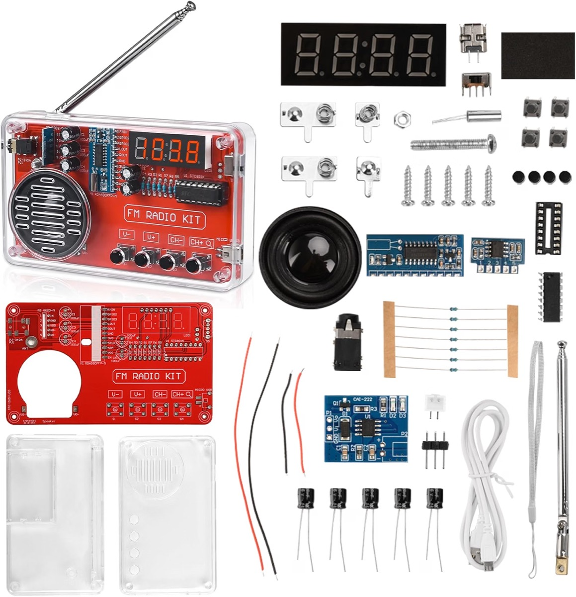

# Next: build an FM radio with the team

**The next milestone is one physical project: an FM radio kit, built from
parts and then put under agent control.** The person builds the radio, and
the team takes over the tuning in three ways, one after the other: it
presses the buttons (path A), it drives the tuner chip over I²C (path B),
and it replaces the firmware of the microcontroller (path C).
[`fm-radio.md`](fm-radio.md) describes the kit and the three paths.

**Situation awareness is the center of the milestone.** The team must know
which parts are on the table, which step the build is at, what each
instrument reads, what the radio does, and what the bench sounds like, at
all times. It notices a change with no word from the person, and backs
each claim with evidence.

**Ambion and Workbench grow in parallel.** Each activity names what it
needs from each. A capability that serves any room goes into Ambion. A
capability that is about the bench goes into Workbench.

## The workstation: a Lambda Vector

**A Lambda Vector becomes the workstation of the workspace.** It has two
RTX 4090 GPUs and 128 GB of RAM. The agents' shells, the git repositories,
and the perception of images and sound run on it. The terminal of the
person connects to it over SSH, as it connects to the local container of
`workstation/` today.

- **The bench devices plug into it.** The HM310P, the BRIO, the USB
  microphone, the Pico, and the radio connect to its USB ports. Linux sees
  each device natively, with no passthrough.
- **Perception runs on its GPUs.** A vision model reads the frames of the
  camera, and an audio model classifies what the microphone hears.
- **The frames and the sound stay on it.** No image or recording leaves the
  lab for a remote model unless the person asks.
- **The layout of the workspace carries over.** The accounts, the groups,
  and the folders follow `workstation/Dockerfile` and
  `workstation/entrypoint.sh`, in a container or on the host.

## The outcome

**The milestone is done when the team tunes the radio in each of the three
paths, and guides the build of the second kit.** At every step, the person
can ask "what is going on?", and the team answers with the state of the
bench and the evidence for it.

| #   | Objective                                                                                                           |
| --- | ------------------------------------------------------------------------------------------------------------------- |
| 1   | The team knows the state of the bench at all times: the parts, the build step, the instruments, and the radio       |
| 2   | The team notices a device event or a change of the supply within 10 seconds, and names it                           |
| 3   | The team notices a change on the bench in the camera, and a change of sound in the microphone, and names it         |
| 4   | The team hears the radio: whether it plays a station, noise, or nothing, with a clip as evidence                    |
| 5   | Path A: the team tunes by pressing the buttons, and reads the frequency from the display                            |
| 6   | Path B: the team tunes any frequency over I²C, and maps the stations of the band by signal strength and sound       |
| 7   | The team guides the build of the second kit, and checks the placement and the orientation of each polarized part    |
| 8   | The first power-on of the second kit is current-limited by the HM310P, and the team stops it on an abnormal current |
| 9   | Path C: new firmware takes serial commands, and the buttons and the display still work                              |
| 10  | An eval on the simulator grades the awareness of the team on the cases of activity 9                                |

## Situation awareness

**The team keeps a live model of the bench, with evidence for each fact.**
Every activity feeds it, and every activity reads it.

- **A bench model.** Each fact has a subject, a source (the person, the
  camera, the microphone, an instrument, a datasheet), a time, and a
  confidence. It holds the parts, the build step, the connections, the
  instruments, and the state of the radio. A disagreement between two
  sources stays open as a conflict until the person or new evidence
  resolves it.
- **Three senses.**
  - **Instruments:** device events, and the readings of the supply and the
    radio.
  - **Sight:** frames of the camera, compared on change. A vision model
    reads a frame only when something changed. It reports the presence, the
    place, and the orientation of a part, and the digits of a display.
  - **Hearing:** the USB microphone, with its level and spectrum. An audio
    model tells a station from noise and from silence. It works when the
    camera does not.
- **Attention.** A significant change wakes the seat that it concerns. A
  routine reading updates the model and wakes no one.
- **Evidence.** A visual claim cites a crop of a frame. A claim about sound
  cites a clip and its level. A claim about the radio cites a reading.
- **Privacy.** Frames crop to the bench, and faces blur before any frame is
  stored. The microphone keeps a clip only as the evidence of a claim.

**Ambion:** observation entries in the journal (source, time, confidence,
media refs), wake sources that activate a seat on an external event, a
shared state resource of the room, and reminders that give each seat what
changed since it last looked.

**Workbench:** the bench model and its schema, a perception service on the
GPUs of the workstation, and a bench panel in the terminal.

## The activities, in order

**The work comes in slices.** The first kit, built by hand, carries paths A
and B early, with the awareness they need. The awareness then deepens, and
the second kit carries the guided build. Path C comes last. Activity 1 runs
in parallel with the rest.

Each activity ends with a result that the person can check. Check off an
item when it ships, and remove an activity when every item is done.

### 1. Make the Lambda Vector the workstation

- [ ] Prepare the accounts, the groups, and the folders of the workspace,
      as `workstation/` does, and write its `workstation.json`.
- [ ] Connect the HM310P, the BRIO, and the USB microphone to its USB
      ports, and give Instruments their device files.
- [ ] Serve a vision model and an audio model on its GPUs, reachable from
      the perception service.

**Done when** Workbench connects to it, `device-scan` finds the HM310P, the
BRIO, and the microphone, and each model answers a test request within its
time budget.

### 2. Know the kit, and build the first one

- [ ] Record each part of the kit in the bench model: the name, the value,
      and the count.
- [ ] Put the datasheets in `library/`: the RDA5807FP, the STC8G1K, the
      amplifier module, and the power module.
- [ ] Record the schematic of the board, from the kit's documentation or
      from the photos of the board.
- [ ] The person builds the first kit by hand.
- [ ] Settle the facts that [`fm-radio.md`](fm-radio.md) lists as open.

**Done when** the first radio plays a station, and the team answers "what
is in the kit?" with each part and its evidence.

### 3. Hear the radio

- [ ] The microphone on the workstation, with its level and spectrum as
      readings.
- [ ] The audio model tells a station from noise and from silence.
- [ ] A clip of the radio as the evidence of each claim about its sound.

**Done when** the person switches the radio on and off, and moves it off
a station, and the team names each change with a clip.

### 4. Path A: press the buttons

- [ ] The Pico presses CH+, CH−, V+, and V− through the ELEGOO kit's
      transistors or its 4N35 optocoupler.
- [ ] The team reads the frequency from the display with the camera.

**Done when** the person asks for a station, the team steps to it, and the
display, the camera, and the sound agree.

### 5. Path B: drive the tuner over I²C

- [ ] The Pico takes the I²C bus of the RDA5807, with the STC8G1K out of
      its socket.
- [ ] An `fm-radio` template: `tune`, `seek`, `scan`, `status`, and
      `listen`.
- [ ] A scan of 87.5 to 108 MHz makes a station map by signal strength,
      checked by sound.

**Done when** the team tunes any frequency the person names, and a summary
cites the station map.

### 6. Situation awareness in depth

- [ ] The bench model, with its schema, sources, and conflicts.
- [ ] Device events, the readings of the supply and the radio, the camera,
      and the microphone feed the model, and a significant change wakes the
      seat that it concerns.
- [ ] A bench panel in the terminal: the model, the conflicts, the last
      frame, the sound level, and the readings.

**Done when** the person moves a part, plugs a device, changes the supply,
and mutes the radio, with no word, and the team names each change with its
evidence.

### 7. Guide the build of the second kit

- [ ] The build procedure as a template: the parts of each step, their
      places, their orientation, and the check of the step.
- [ ] The team follows the assembly from the camera, and checks the
      placement and the orientation of each polarized part before it is
      soldered.
- [ ] The first power-on through the HM310P, current-limited, with the
      expected current from the datasheets.

**Done when** the second radio plays a station, and the room's record
holds each step with its evidence.

### 8. Path C: new firmware for the microcontroller

- [ ] A toolchain for the STC8G1K: a compiler and a flasher.
- [ ] The pins of the display and the buttons, from the schematic.
- [ ] Firmware that takes serial commands, and keeps the buttons and the
      display.
- [ ] A spare STC8G1K keeps the stock firmware, which cannot be read back.

**Done when** the team tunes over serial, a button press still works, and
the display shows the frequency that the team set.

### 9. The eval of awareness

- [ ] A simulated bench: recorded frames, recorded clips, simulated device
      events, and the `hm310p` simulator.
- [ ] Cases of a bench that disagrees with itself: an open circuit, a
      lead in the ground terminal, a device that the host lost, and a lit
      part at 0 mA.

**Done when** the eval grades each case, and a case fails when the team
claims what its evidence does not show.
