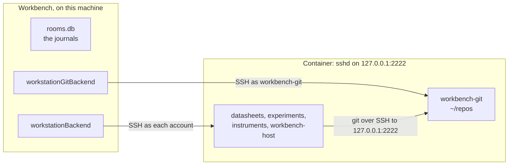

# A local workstation

**This folder builds a workstation in a container.** A workstation is one
server with one Unix account for each specialist
([Ambion: the workstation](https://github.com/ambionframework/ambion/blob/main/docs/workstation.md)).
Workbench runs the `bash` and file tools of each specialist on it over SSH,
as that specialist's account. The git account of the workstation holds the
templates and the forks. The journals of the rooms stay in the SQLite file
of Workbench.



## Start it

**`make` does the three steps below, and starts Workbench.** Run it from
the root of the repository. It skips each step that is done: the keys stay,
and the image builds again only when a file of it changes.

| Target                    | What it does                                                               |
| ------------------------- | -------------------------------------------------------------------------- |
| `make`, `make workbench`  | The workstation up, then Workbench on it. `DATA=` names the data directory |
| `make workstation`        | The workstation up, and nothing else                                       |
| `make stop`               | Stop the workstation. The volumes keep every file                          |
| `make logs`, `make shell` | Follow the log of `sshd`, or open a root shell                             |
| `make ssh ACCOUNT=<name>` | A shell as one account, over `ssh`                                         |
| `make test-workstation`   | The workspace tier on the workstation, with no model                       |
| `make reset`              | Remove the workstation and its volumes, after a prompt                     |

The steps, by hand:

1. Write the keys, the host key, and `workstation.json` into
   `.workstation/`. Git ignores the folder: it holds private keys.

   ```sh
   bash workstation/setup.sh
   ```

2. Build and start the container. `sshd` listens on `127.0.0.1:2222`
   only.

   ```sh
   docker compose -f workstation/compose.yaml up -d --build --wait
   ```

3. Start Workbench on it.

   ```sh
   WORKBENCH_WORKSTATION=.workstation/workstation.json pnpm start
   ```

**Without `WORKBENCH_WORKSTATION`, Workbench runs as before.** The bash
backend is a just-bash directory under the data directory, and the git
backend runs in the Workbench process.

## What the container holds

| Account          | Group       | Holds                                                    |
| ---------------- | ----------- | -------------------------------------------------------- |
| One per seat     | `workbench` | The home of the specialist, mode `0700`, and its clones  |
| `workbench-host` | `workbench` | The host account: it writes the seed and the room mirror |
| `workbench-git`  | none        | Every repository, in `~/repos`. Agents reach it over SSH |

| Path                   | Writer                 | Readers                    |
| ---------------------- | ---------------------- | -------------------------- |
| `/library`             | `workbench-host`       | Every account of the group |
| `/shared`              | Every account of group | Every account of the group |
| `/srv/workbench/audit` | Every account of group | Every account of the group |
| `/srv/workbench/rooms` | `workbench-host`       | Every account of the group |

**The entrypoint sets the layout at each start.** A named volume drops the
ACLs of the image, so the script makes each folder and sets its default
ACL again. It also installs the public key of each account from
`.workstation/keys`.

**The container has the tools of the specialists:** `bash`, `git`,
`sqlite3`, and `python3`. Add a tool to an `apt-get install` line of the
`Dockerfile`, and rebuild.

## Devices

**Instruments has the tools to find and drive the devices of the bench.**
The `device-scan` template runs them all, and writes one report
(`templates/device-scan`).

| Tool                                   | Finds                                              |
| -------------------------------------- | -------------------------------------------------- |
| `lsusb`, sysfs                         | Each USB device, its ID, and its interface class   |
| `python3-serial`                       | The serial ports: a USB-serial chip, or CDC-ACM    |
| `pyvisa`, `pyvisa-py`, `pyusb`, libusb | USBTMC instruments, with no kernel driver          |
| `v4l2-ctl`, `gphoto2`                  | USB cameras (UVC), and cameras that gphoto2 drives |
| `nmap`                                 | The SCPI ports of the instruments on a subnet      |

**Instruments is in the groups `dialout`, `video`, and `plugdev`.** The
container mounts `/dev/bus/usb` with a rule for every USB device file, so
libusb reaches a device that arrives after the start. The container runs no
udev, so the entrypoint gives `plugdev` read and write on each USB device
file every 5 seconds.

**The workstation makes the device file of each camera, serial port, and
USBTMC instrument.** The container's own `/dev` holds no file for a device
that arrives after the start. The entrypoint reads the major and minor
numbers in `/sys` every 5 seconds, makes `/dev/video*`, `/dev/ttyUSB*`,
`/dev/ttyACM*`, and `/dev/usbtmc*` with the group of Instruments, and removes
the file of a device that went away. `compose.yaml` allows these device
types. No `devices:` entry is needed.

**Capture a frame** as Instruments:

```sh
v4l2-ctl --list-devices                          # the cameras
v4l2-ctl -d /dev/video0 --list-formats-ext       # their formats and sizes
fswebcam -d /dev/video0 -r 1280x720 -S 10 --no-banner frame.jpg
python3 -c "from PIL import Image; import numpy; print(numpy.asarray(Image.open('frame.jpg').convert('L')).mean())"
```

`-S 10` skips 10 frames, so the exposure settles. The last line prints the
mean brightness of the frame.

**OrbStack's Linux has the drivers of the bench as modules:** `uvcvideo`
for a UVC camera, `cdc-acm`, `ftdi_sio`, `ch341`, `cp210x`, and `pl2303` for
a serial port, and `usbtmc` for an instrument. A module loads when its
device arrives.

**With OrbStack on macOS, attach a device to Linux first:**

```sh
orb usb list            # find the device
orb usb attach <id>     # hand it to OrbStack's Linux
```

A serial adapter stays usable on macOS. Any other device leaves macOS until
`orb usb detach <id>`.

## Look inside

- **Log in as one account,** with the key and the host key of
  `.workstation/`:

  ```sh
  ssh -p 2222 -i .workstation/keys/experiments -o IdentitiesOnly=yes \
    -o UserKnownHostsFile=.workstation/known_hosts experiments@127.0.0.1
  ```

  The git account refuses a shell for an agent key. The host key of
  `workbench-git` opens one.

- **Open a root shell** in the container, to read every home:

  ```sh
  docker compose -f workstation/compose.yaml exec workstation bash
  ```

- **Follow the log of sshd:**

  ```sh
  docker compose -f workstation/compose.yaml logs -f
  ```

- **Stop it, and start it again.** The volumes keep every file.

  ```sh
  docker compose -f workstation/compose.yaml stop
  docker compose -f workstation/compose.yaml start
  ```

## Change it

- **Add a specialist.** Add its name to `accounts`, run `setup.sh` again,
  and rebuild with `--build`. `test/workstation-config.test.ts` fails
  while the list and the team differ.
- **Keep the keys.** `setup.sh` keeps each key that exists, so a second
  run changes nothing for the running container.
- **Start again from empty.** This command removes the container and its
  volumes: the homes, the repositories, `/library`, and `/shared`.

  ```sh
  docker compose -f workstation/compose.yaml down -v
  ```

## Test it

`test/workstation.test.ts` runs the workspace on the container with
scripted seats and no model. It skips when `WORKBENCH_WORKSTATION` is not
set.

```sh
WORKBENCH_WORKSTATION=.workstation/workstation.json pnpm exec vitest run test/workstation.test.ts
```
