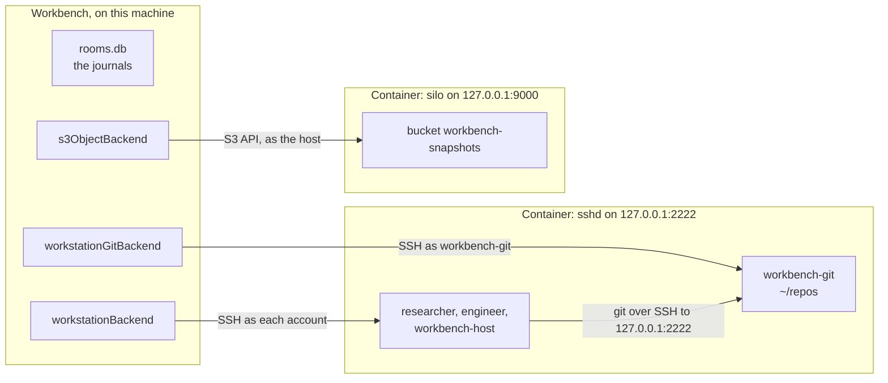

# A local workstation, in a container

**This is the old path. The Mac is the workstation now.**
[`macos/`](macos/README.md) sets up the workstation on the Mac itself, and
`make` runs it. The container below still builds and starts with
`make workbench`. The device templates (`device-scan`, `usb-camera`, `psu`)
use `system_profiler` and AVFoundation, so they do not work in the container.
The sections on the devices describe the Linux tools of the container.
A later change removes the container.

**This folder builds a workstation in a container.** A workstation is one
server with one Unix account for each specialist
([Ambion: the workstation](https://github.com/ambionframework/ambion/blob/main/docs/workstation.md)).
Workbench runs the `bash` and file tools of each specialist on it over SSH,
as that specialist's account. The git account of the workstation holds the
templates and the forks. The journals of the rooms stay in the SQLite file
of Workbench. A second container, an object store, keeps the bytes of the
snapshots.

**A Mac hosts the workstation itself.** [`macos/`](macos/README.md) sets up
the same backend on the sshd of the Mac, with one hidden OS user for each
seat and the USB devices native.


```mermaid
flowchart LR
  subgraph host["Workbench, on this machine"]
    journals["rooms.db<br/>the journals"]
    bash["workstationBackend"]
    git["workstationGitBackend"]
    s3["s3ObjectBackend"]
  end
  subgraph box["Container: sshd on 127.0.0.1:2222"]
    agents["researcher, engineer,<br/>workbench-host"]
    repos["workbench-git<br/>~/repos"]
  end
  subgraph store["Container: silo on 127.0.0.1:9000"]
    bucket["bucket workbench-snapshots"]
  end
  bash -- "SSH as each account" --> agents
  git -- "SSH as workbench-git" --> repos
  agents -- "git over SSH to 127.0.0.1:2222" --> repos
  s3 -- "S3 API, as the host" --> bucket
```

## Start it

**`make workbench` does the four steps below, and starts Workbench.** Run it
from the root of the repository. `make` alone runs the workstation of the
Mac. Each step skips what is done: the keys stay, and the image builds
again only when a file of it changes.

| Target                        | What it does                                                               |
| ----------------------------- | -------------------------------------------------------------------------- |
| `make workbench`              | The workstation up, then Workbench on it. `DATA=` names the data directory |
| `make workstation`            | The workstation and the object store up, and the USB devices attached      |
| `make usb`, `make usb-detach` | Attach the USB devices to OrbStack's Linux, or give them back              |
| `make stop`                   | Stop the workstation. The volumes keep every file                          |
| `make logs`, `make shell`     | Follow the logs of `sshd` and the object store, or open a root shell       |
| `make ssh ACCOUNT=<name>`     | A shell as one account, over `ssh`                                         |
| `make test-workstation`       | The workspace tier on the workstation, with no model                       |
| `make reset`                  | Remove the workstation and its volumes, after a prompt                     |

The steps, by hand:

1. Write the keys, the host key, and `workstation.json` into
   `.workstation/`. Git ignores the folder: it holds private keys.

   ```sh
   bash workstation/setup.sh
   ```

2. Build and start the workstation and the object store. `sshd` listens on
   `127.0.0.1:2222` only, and the S3 API on `127.0.0.1:9000` only.

   ```sh
   docker compose -f workstation/compose.yaml up -d --build --wait workstation objects
   ```

3. Make the bucket and its user. The job ends by itself, so `up --wait`
   cannot include it. A second run changes nothing but the secret of the
   user.

   ```sh
   docker compose -f workstation/compose.yaml run --rm objects-init
   ```

4. Start Workbench on it.

   ```sh
   WORKBENCH_WORKSTATION=.workstation/workstation.json pnpm start
   ```

**A start that cannot reach the workstation stops with one message.** It
names the host and the port, the host account and the git account with
the path of each key, and the SSH error. A missing or broken
`workstation.json` stops the start with its path.

**Without `WORKBENCH_WORKSTATION`, Workbench runs as before.** The bash
backend is a just-bash directory under the data directory, and the git
backend runs in the Workbench process.

## The object store

**The snapshots of the agents live in a bucket, not on the workstation
disk.** The `objects` service runs
[PGSTY Silo](https://github.com/pgsty/silo), the maintained fork of MinIO. The
fork was `pgsty/minio` until 2026-08-06. The image is pinned to a release tag in
`compose.yaml`. Workbench reaches the bucket with `s3ObjectBackend`, so a
snapshot ref resolves to bytes that a later change to the file cannot alter.

**Two credentials exist, both in `.workstation/objects.env`.** `setup.sh`
writes the file with mode `0600` and keeps it on a second run.

| Pair                                       | Held by            | Can do                                 |
| ------------------------------------------ | ------------------ | -------------------------------------- |
| `MINIO_ROOT_USER`, `MINIO_ROOT_PASSWORD`   | The store, the job | Everything. The job uses it once       |
| `S3_ACCESS_KEY_ID`, `S3_SECRET_ACCESS_KEY` | Workbench          | Read and write the bucket, and list it |

**No agent holds a credential.** The host account of Workbench writes and
reads the objects. An agent asks for a snapshot with the `snapshot` tool and
for its bytes with `restore`. The `objects` block of `workstation.json`
names the endpoint, the bucket, and the key prefix. Delete the block, and the
workstation keeps the snapshots in `/srv/workbench/snapshots` again.

**`make reset` removes the snapshots with the other volumes.** A ref then
resolves to no object.

## What the container holds

| Account          | Group       | Holds                                                    |
| ---------------- | ----------- | -------------------------------------------------------- |
| One per seat     | `workbench` | The home of the specialist, mode `0700`, and its clones  |
| `workbench-host` | `workbench` | The host account: it writes the seed and the room mirror |
| `workbench-git`  | none        | Every repository, in `~/repos`. Agents reach it over SSH |

| Path                       | Writer                 | Readers                    |
| -------------------------- | ---------------------- | -------------------------- |
| `/library`                 | `workbench-host`       | Every account of the group |
| `/shared`                  | Every account of group | Every account of the group |
| `/attachments`             | `workbench-host`       | Every account of the group |
| `/srv/workbench/audit`     | Every account of group | Every account of the group |
| `/srv/workbench/rooms`     | `workbench-host`       | Every account of the group |
| `/srv/workbench/snapshots` | `workbench-host`       | Every account of the group |

**The entrypoint sets the layout at each start.** A named volume drops the
ACLs of the image, so the script makes each folder and sets its default
ACL again. It also installs the public key of each account from
`.workstation/keys`.

**The container has the tools of the specialists:** `bash`, `git`,
`sqlite3`, and `python3`. Add a tool to an `apt-get install` line of the
`Dockerfile`, and rebuild.

## Devices

**These are the Linux device tools of the container.** The templates
`device-scan` and `usb-camera` no longer use them: they run on macOS. The
section stays until the container goes.

**The Engineer has the tools to find and drive the devices of the bench.**

| Tool                  | Finds                                              |
| --------------------- | -------------------------------------------------- |
| `lsusb`, sysfs        | Each USB device, its ID, and its interface class   |
| `python3-serial`      | The serial ports: a USB-serial chip, or CDC-ACM    |
| sysfs                 | USBTMC instruments, by their interface class       |
| `v4l2-ctl`, `gphoto2` | USB cameras (UVC), and cameras that gphoto2 drives |
| `arecord`             | USB microphones (ALSA sound cards)                 |

**Engineer is in the groups `dialout`, `video`, `audio`, and `plugdev`.** The
container mounts `/dev/bus/usb` with a rule for every USB device file, so
libusb reaches a device that arrives after the start. The container runs no
udev, so the entrypoint gives `plugdev` read and write on each USB device
file every 5 seconds.

**The workstation makes the device file of each camera, serial port,
USBTMC instrument, and sound device.** The container's own `/dev` holds no
file for a device that arrives after the start. The entrypoint reads the
major and minor numbers in `/sys` every 5 seconds, makes `/dev/video*`,
`/dev/ttyUSB*`, `/dev/ttyACM*`, `/dev/usbtmc*`, and `/dev/snd/*` with the
group of Engineer, and removes the file of a device that went away.
`compose.yaml` allows these device types. The ALSA rule is `c 116:* rmw`.
Without it, opening `/dev/snd` fails with "Operation not permitted". No
`devices:` entry is needed.

**Capture a frame** as Engineer:

```sh
v4l2-ctl --list-devices                          # the cameras
v4l2-ctl -d /dev/video0 --list-formats-ext       # their formats and sizes
fswebcam -d /dev/video0 -r 1280x720 -S 10 --no-banner frame.jpg
python3 -c "from PIL import Image; import numpy; print(numpy.asarray(Image.open('frame.jpg').convert('L')).mean())"
```

`-S 10` skips 10 frames, so the exposure settles. The last line prints the
mean brightness of the frame.

**Record a clip** as Engineer:

```sh
arecord -l                                       # the sound cards
arecord -D plughw:CARD=BRIO,DEV=0 -f S16_LE -r 48000 -c 1 -d 5 clip.wav
```

`arecord -l` prints a line such as `card 1: BRIO [Logitech BRIO]`. The card
id `BRIO` stays the same after a reconnect. The card number does not: card 0
is the sound card of OrbStack. Use `plughw:CARD=<id>,DEV=0`, so ALSA
converts to mono 48 kHz. The BRIO records 16-bit samples (`S16_LE`) in two
channels, from 16000 to 48000 Hz. Docker hides `/proc/asound` in the
container. `arecord -l` still works.

To keep the frames and the clips as evidence, the Engineer forks the
[`usb-camera` template](../templates/usb-camera/README.md). The template
uses AVFoundation, which exists only on macOS, so it does not run in the
container. The server listens on the loopback address of the workstation,
on the port of `$PORT`. Ambion 0.7.0 carries each `fetch` through SSH forwarding.
`fetch` saves the observation and the frame or clip in the snapshot store.
Docker publishes no sensor port. Other seats fetch from the same process and
need no access to the home of Engineer.

**OrbStack's Linux has the drivers of the bench as modules:** `uvcvideo`
for a UVC camera, `snd-usb-audio` for a USB microphone, `cdc-acm`,
`ftdi_sio`, `ch341`, `cp210x`, and `pl2303` for a serial port, and `usbtmc`
for an instrument. A module loads when its device arrives.

**With OrbStack on macOS, `make` attaches the USB devices to its Linux.**
`make workstation`, and so `make`, runs `make usb` after the container
starts. It attaches every USB device of the Mac, except:

- a keyboard, a mouse, or another input device, which macOS needs;
- the billboard device of a USB-C hub, which does nothing;
- each vendor:product ID that `workstation/usb-ignore` names.

An attached device leaves macOS, except a serial adapter, which stays
usable on both. `make usb-detach` gives the devices back. A second
`make usb` changes nothing, and it attaches a device again after a replug
or a restart of OrbStack. It also attaches again a device that OrbStack
holds and Linux lost: it counts the devices of each USB ID on both sides.
It leaves a device that another OrbStack machine holds. On a machine without OrbStack, the devices are
native, and `make usb` does nothing.

## Look inside

- **Log in as one account,** with the key and the host key of
  `.workstation/`:

  ```sh
  ssh -p 2222 -i .workstation/keys/researcher -o IdentitiesOnly=yes \
    -o UserKnownHostsFile=.workstation/known_hosts researcher@127.0.0.1
  ```

  The git account refuses a shell for an agent key. The host key of
  `workbench-git` opens one.

- **Open a root shell** in the container, to read every home:

  ```sh
  docker compose -f workstation/compose.yaml exec workstation bash
  ```

- **Follow the log of sshd:**

  ```sh
  docker compose -f workstation/compose.yaml logs -f
  ```

- **Stop it, and start it again.** The volumes keep every file.

  ```sh
  docker compose -f workstation/compose.yaml stop
  docker compose -f workstation/compose.yaml start
  ```

## Change it

- **Add a specialist.** Add its name to `accounts`, run `setup.sh` again,
  and rebuild with `--build`. `test/workstation-config.test.ts` fails
  while the list and the team differ.
- **Keep the keys.** `setup.sh` keeps each key that exists, so a second
  run changes nothing for the running container.
- **Start again from empty.** This command removes the container and its
  volumes: the homes, the repositories, `/library`, `/shared`, `/attachments`,
  and the snapshots.

  ```sh
  docker compose -f workstation/compose.yaml down -v
  ```

## Test it

`test/workstation.test.ts` runs the workspace on the container with
scripted seats and no model. It skips when `WORKBENCH_WORKSTATION` is not
set.

```sh
WORKBENCH_WORKSTATION=.workstation/workstation.json pnpm exec vitest run test/workstation.test.ts
```
