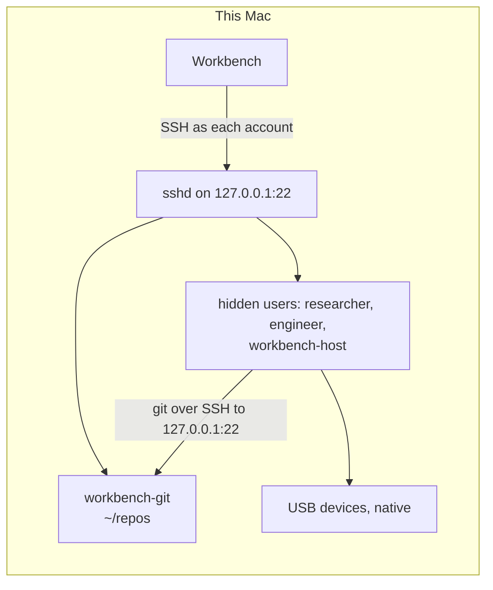

# A workstation on this Mac

**This folder sets up the workstation of Workbench on the Mac itself.** The
backend is the same as in the container of [`workstation/`](../README.md):
one server with one Unix account for each specialist, reached over SSH
([Ambion: the workstation](https://github.com/ambionframework/ambion/blob/main/docs/workstation.md)).
Here the server is the sshd of the Mac, and the accounts are hidden macOS
users. Workbench reaches it on `127.0.0.1`, port 22.

**Two reasons to use it.** The USB devices stay native: no
`orb usb attach`, and a serial adapter, a camera, and a microphone keep their
macOS drivers. Each seat still has its own OS user, so one seat cannot read
the home of another. The same setup fits a lab Mac that several people join
over remote desktop.



## Start it

**An admin runs `make mac-workstation`.** The command asks for the sudo
password. A second run changes nothing.

| Target                 | What it does                                                      |
| ---------------------- | ----------------------------------------------------------------- |
| `make mac-workstation` | Run `setup.sh` with sudo                                          |
| `make mac-workbench`   | Start Workbench on the workstation. `DATA=` names the data folder |
| `make mac-teardown`    | Run `teardown.sh` with sudo, after a prompt                       |

The steps, by hand:

1. Install the tools that the backend and the templates need. Run the
   commands as the admin. Homebrew refuses root.

   ```sh
   brew install python coreutils ffmpeg
   python3 -m pip install --break-system-packages pyserial numpy pillow
   ```

   Python 3.11 or newer is the floor of the templates. `ffmpeg` serves the
   camera and the microphone. Homebrew marks its Python as externally
   managed, so `pip` needs `--break-system-packages` to write to it. The
   seats use that one Python.

2. Run the setup. The argument is the state folder, `.workstation` by
   default.

   ```sh
   sudo bash workstation/macos/setup.sh
   ```

3. Start Workbench on it.

   ```sh
   WORKBENCH_WORKSTATION=.workstation/macos.json pnpm start
   ```

**The setup ends with a check.** It logs in as Engineer with the key of
Engineer, as the admin, and runs the tools that the backend needs. It prints
a warning for each tool that the seat lacks. A failed login stops the script
with an exit status of 1.

## What the setup makes

| Item                    | Where                                       | Content                                                                       |
| ----------------------- | ------------------------------------------- | ----------------------------------------------------------------------------- |
| One user for each seat  | uid 5000 and up, in the order of `accounts` | Hidden, standard, home `/Users/<name>`, 0700                                  |
| The git account         | `workbench-git`, uid 5900                   | Hidden, standard, outside the group                                           |
| The group `workbench`   | gid 5000                                    | Every account of `accounts`                                                   |
| The data folder         | `/Users/Shared/workbench`                   | `srv/audit`, `srv/rooms`, `srv/snapshots`, `shared`, `library`, `attachments` |
| The root links          | `/etc/synthetic.conf`                       | `/library`, `/shared`, `/attachments`                                         |
| The sshd drop-in        | `/etc/ssh/sshd_config.d/100-workbench.conf` | One `Match User` block                                                        |
| The shims and the state | `/usr/local/libexec/workbench`              | `setsid`, `flock`, and the state of Remote Login                              |
| The keys and the config | `.workstation/` in the repository           | `keys/`, `macos.json`, `macos.known_hosts`                                    |

**The setup reuses the key layout of the container.** The files
`keys/<account>` and `keys/<account>.pub` stay if they exist, so the
container and the Mac share the keys. `workstation.json` stays as it is.
The Mac has its own file, `macos.json`, with no `objects` block: the
workstation keeps the snapshots in `srv/snapshots`.

**The folders follow `entrypoint.sh` of the container.** Every seat writes
`srv/audit` and `shared`. Only `workbench-host` writes `srv/rooms`,
`srv/snapshots`, `library`, and `attachments`. Every seat reads them. A
group ACL with inheritance keeps `srv/audit` and `shared` writable for the
group whatever the umask of a tool is. macOS gives a new file the group of
its folder, so no setgid bit is needed.

## Security model

- **One account for each seat.** A seat reads and writes only its own home
  (mode 0700), `shared`, and the folders that the group may read. The
  accounts are standard users: none can use `sudo`.
- **Keys only.** Each account has one Ed25519 key. The Match block sets
  `AuthenticationMethods publickey` and turns off the password methods. The
  password of each account is `*`, a value that no password matches.
- **Loopback only.** Each `authorized_keys` line starts with
  `from="127.0.0.1,::1"`. The key of an account opens no session from
  another address. The git backend limits the keys of the agents the same way.
- **The Mac keeps its own sshd settings.** The drop-in changes no port and no
  listen address. The admin can still use ssh from other machines.
- **Protect your own home.** Run `chmod 700 ~`. The home folder of macOS has
  mode 0755, and the seats are other users of the Mac, so they can list it.
- **No limit on network egress.** A seat can open any connection that a
  standard user can open.
- **The rule to switch the power supply on is text.** Only the skill
  `drive-the-power-supply` states it. No account, group, or file mode
  enforces it.

## The choices behind it

**Accounts have no password and a working key login.** Each user record
has `Password *` and no `AuthenticationAuthority`. The mark
`;DisabledUser;` is wrong for this use: the PAM account check of sshd then
refuses every login, key logins too. With no attribute, a password cannot
match, and the account check passes. The setup makes the records with
`dscl` and a fixed `GeneratedUID`. A random password from `sysadminctl`
would show in `ps` while the command runs. The setup uses `sysadminctl` only
to delete a user.

**The device files need no extra group.** The files `/dev/cu.*` and
`/dev/tty.*` of a USB serial adapter have mode `crw-rw-rw-` and the owner
`root:wheel`. Every standard user opens them, so Engineer needs no group
such as `dialout`.

**The root folders are links.** The root of macOS is read-only. The setup adds
one line for each folder to `/etc/synthetic.conf`, the supported way to add
a name to `/`. The target is the folder under `/Users/Shared/workbench`.
`apfs.util -t` applies the lines without a restart on a current macOS. The
setup tells you when a restart is still needed. The layout paths in
`macos.json` name the real folders.

**Ambion works with a linked root.** SFTP follows a link, and the backend
resolves a path with `realpath` and reads the real file. A snapshot keeps
the path that the agent used, such as `/shared/x`. One limit exists in
Workbench: the file panel refuses a path with a link in it
(`checkAncestors` in `src/host/files.ts`). The panel lists the files of
`/shared` and does not preview them. A change that lets the panel accept
the three root links removes this limit. The setup does not include it.

**The backend needs GNU tools that macOS lacks.** The scripts of Ambion run
`setsid --wait`, `flock`, `date -d`, `date +%s%3N`, `stat -c`, and
`base64 -w0`. The setup installs two Perl shims, `setsid` and `flock`, in a
folder that only root writes. The GNU `date`, `stat`, and `base64` come from
Homebrew coreutils, which the setup requires. The setup stops with a clear
message when coreutils is missing.

**The PATH comes from `~/.zshenv`.** sshd runs each command as
`<login shell> -c`. The login shell of an account is `/bin/zsh`, which reads
`~/.zshenv` for every start, even a non-interactive one. The file puts the
shims, the GNU tools, and `/opt/homebrew/bin` before the default PATH
`/usr/bin:/bin:/usr/sbin:/sbin`. The backend then starts `bash -s`, which is
the bash 3.2 of macOS. `PermitUserEnvironment` stays off.

**sshd needs no reload.** macOS starts sshd for each connection through
launchd, so a new connection reads the drop-in. The setup runs `sshd -t`
before it finishes, and it removes the drop-in when `sshd -t` fails. Then it
runs `sshd -T` for Engineer and for the git account, and it stops when
another file of `sshd_config.d` sets a keyword before the drop-in does.

**Remote Login keeps its state.** The setup turns Remote Login on when it is
off, and it writes the earlier state to `/usr/local/libexec/workbench/state`.
`systemsetup` needs Full Disk Access for the terminal. When it fails, the
setup tries `launchctl enable` and `launchctl bootstrap`, and then it prints
the manual step: System Settings, General, Sharing, Remote Login. When the
group `com.apple.access_ssh` exists, the accounts join it. The setup adds
nobody else and removes nobody. It warns when the admin is not a member.

## Undo it

**`make mac-teardown` removes the workstation.** It asks once. A second
question covers `/Users/Shared/workbench`, which holds the notes and the
snapshots. `--yes` answers both questions:

```sh
sudo bash workstation/macos/teardown.sh --yes
```

The script does these steps, and a second run finds nothing to do:

1. Remove the drop-in.
2. Remove the accounts from `com.apple.access_ssh`.
3. Delete the users and their homes with `sysadminctl -deleteUser`. Only a
   record with the comment `workbench-macos` goes.
4. Delete the group `workbench`, when it has the same comment.
5. Remove the three lines that the setup added to `/etc/synthetic.conf`. The
   links in `/` stay until the next restart.
6. Put Remote Login back to its state before the setup, then remove
   `/usr/local/libexec/workbench`.
7. Remove `.workstation/macos.json` and `.workstation/macos.known_hosts`.
8. Remove `/Users/Shared/workbench`, after its own question.

The script leaves your account and your files, the keys in `.workstation`,
and the container.

## Look inside

**Log in as one account** with its key and the host key of the Mac:

```sh
ssh -i .workstation/keys/engineer -o IdentitiesOnly=yes \
  -o UserKnownHostsFile=.workstation/macos.known_hosts engineer@127.0.0.1
```

**Dry run.** `WORKBENCH_DRY_RUN=1` prints each privileged command and each
file, and it skips the checks for macOS and for root. `test/workstation-macos.test.ts`
uses it on Linux.

## What is not ready

**The device templates target macOS.** `device-scan` reads `system_profiler`,
pyserial, and the AVFoundation list of `ffmpeg`. `usb-camera` captures with
`ffmpeg -f avfoundation`. `psu` finds the serial port of the HM310P by its
USB ID. The templates run only on macOS. Tests check them with fixtures, and
no Mac ran them.

**No script ran on a real Mac.** Tests run both scripts in a dry run, with
stubs for `dscl`, `dseditgroup`, `systemsetup`, and `launchctl`. They check
the plan: the commands, the files, and the config that Workbench loads. What
macOS does with them is unverified:

- the account check of sshd for a user with `Password *`;
- the `100-workbench.conf` name. It sorts after `100-macos.conf`, so
  another file can set a keyword first. `sshd -T` in the setup catches this;
- the ACL entries, the `synthetic.conf` lines, and `apfs.util -t`;
- `systemsetup` and the `launchctl` fallback for Remote Login;
- the `.zshenv` PATH, and `setsid` and `flock` from the shims;
- the camera and microphone permission of macOS (TCC) for a process that
  ssh starts under a hidden account. macOS can refuse `ffmpeg`, or hold it
  until its time limit, because no window can show the question;
- the field names of `system_profiler` and the text of the `ffmpeg` device
  list, which the tests assume from the output of macOS 14 and 15;
- the CH340 serial adapter of the HM310P as `/dev/cu.usbserial-*`, and the
  driver that macOS uses for it.
